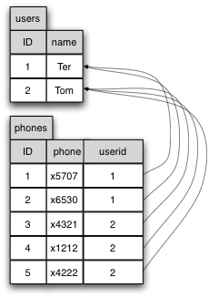
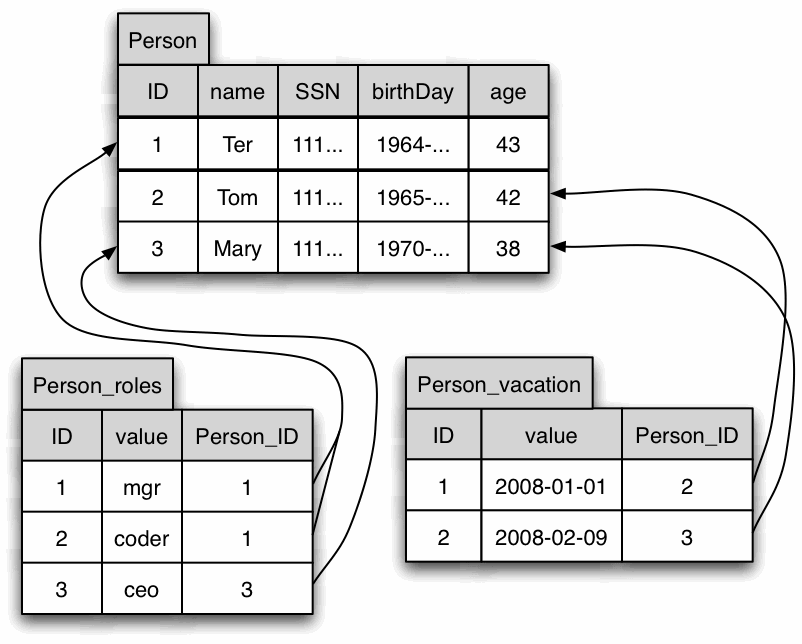

An introduction to SQL databases
====

I highly recommend this gentle introduction: [The Language of SQL](http://www.amazon.com/The-Language-SQL-Relational-Databases/dp/143545751X). You can also get the [data and SQL from the book as a download](http://www.delmarlearning.com/companions/content/143545751X/resources/index.asp?isbn=143545751X).  A few of the tables and sql statements in these notes were derived from that book.

# Why databases?

Question: what's wrong with files for storing data such as this log file:

```
20020901_00.33.12 201927  j@infnomicon.com 
20020901_01.57.16 23349  m@webc.de 
20020901_02.51.58 201927  a@attbdi.com 
...
```

We can use `grep`, `cut`, `paste`, `awk`, and friends to find stuff and can easily read from shell. But, is hard to pull back into a program and can't do anything but simple queries. For example, not easy to do merged queries. Searching is extremely slow for large data as it is linear without an index of some kind.

In order to learn about databases, we will start by using a commandline interface but we will later learn to use Java to connect.

Databases are just tables that act very much like spreadsheets except that we have a declarative programming language called SQL that lets us select rows and columns of interest and even join multiple tables together.

# What do they look like?

Storing a row of data per key is easy. Things get tricky when we need to handle multiple values associated with a single entity, such as multiple phone numbers associated with a single person or user.

These suckers are called relational databases because rows in one table can refer to rows in another table to show a relationship using a *foreign key* (just an integer identifier usually). An SQL query can for example, pull names from one table and phone numbers from another to create a combined view of a person. Foreign keys in one table point usually add what we call the *primary key* in another table. For example, here are two tables with `ID` as primary keys and table `phones` has a foreign key called `userid`:



The "key" here is that these foreign keys point back to the primary table, unlike pointers in a programming language that point at exterior data. Here, the data points back to the owner.

Here's a more complicated example with three tables, 2 of which have foreign keys back into the `Person` table.



Note: we can `alter` and `drop` tables after creation. We can `insert` and `delete` rows from tables.

# SQLite

[SQLite](http://www.sqlite.org/) is an awesome serverless database with a rich SQL query language that you can embed in your application. While not suitable for applications requiring massive throughput, I found it excellent for my projects.  It was able to import 2.6M rows (1.5G) of data in a few seconds, for example. Shockingly, [SQLite is also in the public domain](http://www.sqlite.org/copyright.html), not even under a light license like BSD or MIT.

## Installation

It was already installed on my Mac, but you can easily install with:

```bash
$ brew install sqlite3
```

It's just as easy on other platforms I'm sure.

## Making a sample database

```bash
$ SQLite version 3.7.13 2012-07-17 17:46:21
Enter ".help" for instructions
Enter SQL statements terminated with a ";"
sqlite>
```

*To exit, hit EOF (CTRL-D on UNIX, CTRL-Z on Windows).*

**Make sure you have the latest version.** I belatedly noticed that I had five different versions  and the wrong one was coming up. You want this version or beyond:

```
SQLite version 3.8.6 2014-08-15 11:46:33
```

Let's get friendly with SQL by creating our first table:

```sql
CREATE TABLE Customers(
	ID INT NOT NULL,
	First TEXT, -- let's say it's okay to be null/empty
	Last TEXT NOT NULL
);
```

Then see if there is any data:

```sql
select * from Customers;
```

Nope. Ok, let's do an import of some comma-separated data that has no header row (*the order of values must match the fields we defined in the table above*):

```csv
1,William,Smith
2,Natalie,Lopez
3,Brenda,Harper
```

```
-- stuff that starts with a dot is peculiar to SQLite
.separator ','
.import sample.csv data
```

```bash
$ sqlite3 /tmp/mytest.db
SQLite version 3.7.13 2012-07-17 17:46:21
Enter ".help" for instructions
Enter SQL statements terminated with a ";"
sqlite> select * from Customers;
1|William|Smith
2|Natalie|Lopez
3|Brenda|Harper
sqlite> .mode column
sqlite> .headers on
sqlite> select * from Customers;
ID          First       Last      
----------  ----------  ----------
ID          First       Last      
1           William     Smith     
2           Natalie     Lopez     
3           Brenda      Harper    
```

Another way to get that data and would be to use the following inserts. First, let's delete the old data:

```sql
delete from Customers;
```

then insert new data:

```sql
INSERT INTO Customers (CustomerID, FirstName, LastName) VALUES (1, 'William', 'Smith');
INSERT INTO Customers (CustomerID, FirstName, LastName) VALUES (2, 'Natalie', 'Lopez');
INSERT INTO Customers (CustomerID, FirstName, LastName) VALUES (3, 'Brenda', 'Harper');
```

or just

```sql
INSERT INTO Customers VALUES (1, 'William', 'Smith');
INSERT INTO Customers VALUES (2, 'Natalie', 'Lopez');
INSERT INTO Customers VALUES (3, 'Brenda', 'Harper');
```

# Tables

A database consists of a set of tables and a table consists of rows of data that in turn consist of one or more columns.

## Column Datatypes

[SQLLite Data types](http://www.sqlite.org/datatype3.html).

*I would avoid using column names with spaces*.

SQLite only has the following atomic types:
 
`NULL`, `INTEGER`, `REAL`, `TEXT`, `BLOB`

```sql
sqlite> select typeof(ID), typeof(First) from Customers where ID=1;
integer|text
```

Notice that SQLite allows all sorts of datatype names from other databases but associates them with its own atomic types.

```sql
sqlite> create table T (x DATETIME);
sqlite> select typeof(x) from T;
sqlite> insert into T values ('2014-10-10');
sqlite> select typeof(x) from T;
text
sqlite> drop table T; create table T (x TEXT);
sqlite> insert into T values ('hi');
sqlite> select typeof(x) from T;
text
```

**boolean** values are stored as integers 0 (false) and 1 (true).

**DATETIME** stored as ISO8601 strings `Text`: `"YYYY-MM-DD HH:MM:SS.SSS"` or (`REAL` the number of days since noon in Greenwich on November 24, 4714 B.C) or `INT` Unix Time, the number of seconds since 1970-01-01 00:00:00 UTC.

See [ROWIDs and the INTEGER PRIMARY KEY](http://www.sqlite.org/lang_createtable.html#rowid). All rows have unique `rowid` column already:

```sql
select rowid from customers;
1
2
3
```

Retrieving or sorting records by `rowid` or primary key is fast.

In SQLLite, `INT` primary keys become aliases for `rowid`.

Without a `DEFAULT` value, an insert that does not specify a value gets `NULL`. Some very useful default values: `CURRENT_TIME`, `CURRENT_DATE` or `CURRENT_TIMESTAMP`.

## Data Constraints

[SQLite Data Constraints](https://www.sqlite.org/lang_createtable.html#constraints).

`PRIMARY KEY`: guarantees uniqueness for values in that column and also tells the database engine how you plan on primarily identifying rows in this table. The database will likely index on this key and order the data by this value.

Let's redo the customers table above with primary key:

```sql
drop table Customers;
CREATE TABLE Customers(
	ID INT PRIMARY KEY NOT NULL,
	First TEXT,
	Last TEXT NOT NULL
);
```

Re-insert the data.  Now try it again:

```sql
sqlite> INSERT INTO Customers VALUES (1, 'William', 'Smith');
Error: column ID is not unique
```

`UNIQUE`: like a primary key except you can have multiple unique columns. Together, the unique columns must represent a unique combination of values across all rows.

```sql
sqlite> create table T (x INT UNIQUE, y INT UNIQUE, z TEXT);
sqlite> insert into T values (1,2,'foo');
sqlite> insert into T values (2,1,'foo');
sqlite> insert into T values (1,1,'foo');
Error: column y is not unique
sqlite> insert into T values (1,2,'foo');
Error: column y is not unique
```

`NOT NULL`: the column must have a value.

```sql
sqlite> create table T (name TEXT, price REAL DEFAULT 1.00);
sqlite> insert into T values ('toy');
Error: table T has 2 columns but 1 values were supplied
sqlite> insert into T(name) values ('toy');
sqlite> select * from T;
toy|1.0
sqlite> insert into T values ('toy', 50.23);
sqlite> select * from T;
toy|1.0
toy|50.23
```

[`CHECK`](http://www.sqlite.org/syntaxdiagrams.html#table-constraint): every time you insert or update a row, all checks for the various columns are executed.

```sql
create table T (price REAL CHECK(price>1.01));
sqlite> insert into T values (0.50);
Error: constraint failed
```

`FOREIGN KEY`: see the section on joins below.

# Queries

[SQLite SQL syntax](http://www.sqlite.org/lang.html).

We've already seen some basic queries and here is its most commonly used structure:

`SELECT` *columns* `FROM` *table* `;`

`SELECT` *columns* `FROM` *table* `WHERE` *expression* `;`

```sql
CREATE TABLE Orders(
	OrderID INT NOT NULL,
	FirstName TEXT NULL,
	LastName TEXT NULL,
	QuantityPurchased INT NULL,
	PricePerItem REAL NULL
);
INSERT INTO Orders VALUES (1, 'William', 'Smith', 4, 2.5);
INSERT INTO Orders VALUES (2, 'Natalie', 'Lopez', 10, 1.25);
INSERT INTO Orders VALUES (3, 'Brenda', 'Harper', 5, 4);
```

You can specify which columns you want to see in the output:

```sql
sqlite> .mode column
sqlite> SELECT OrderID,QuantityPurchased,PricePerItem FROM Orders;
OrderID     QuantityPurchased  PricePerItem
----------  -----------------  ------------
1           4                  2.5         
2           10                 1.25        
3           5                  4.0         
```

The column list can be more than just the names of columns. We have already seen the use of `count(*)` to count the number of rows:

```sql
sqlite> select count(*) from orders;
count(*)  
----------
3         
```

but we can also do computations:

```sql
SELECT LastName,QuantityPurchased*PricePerItem FROM Orders;
LastName    QuantityPurchased*PricePerItem
----------  ------------------------------
Smith       10.0                          
Lopez       12.5                          
Harper      20.0
```

and even rename the column in the output:

```sql
SELECT LastName,QuantityPurchased*PricePerItem as Cost FROM Orders;
LastName    Cost      
----------  ----------
Smith       10.0      
Lopez       12.5      
Harper      20.0   
```

The `as` clause will be more useful later when we do joins for multiple tables.

You can alias a table too, `select * from Orders as O;`, which will help out when you have queries with long table names or subqueries that have no name.

You can create new columns by concatenating other columns:

```sql
sqlite> select rowid, FirstName||' '||LastName from Orders;
1           William Smith           
2           Natalie Lopez           
3           Brenda Harper           
4           Janet Smith             
```

## Sorting and grouping

```sql
sqlite> select * from orders order by LastName;
3           Brenda      Harper      5                  4.0         
2           Natalie     Lopez       10                 1.25        
1           William     Smith       4                  2.5         
```

```sql
sqlite> select * from orders order by LastName desc;
1           William     Smith       4                  2.5         
2           Natalie     Lopez       10                 1.25        
3           Brenda      Harper      5                  4.0         
```

Can order by more than one field:

```sql
sqlite> insert into orders values (4,'Janet','Smith',6,0.5);
sqlite> select * from orders order by LastName,FirstName;
3           Brenda      Harper      5                  4.0         
2           Natalie     Lopez       10                 1.25        
4           Janet       Smith       6                  0.5         
1           William     Smith       4                  2.5         
```

This sorts first by last name and then sorts all records with the same last name by the first name. The order in which you mention the names matters.

## Functions

There are lots of [functions](http://www.sqlite.org/lang_corefunc.html) like `upper()` you can use. You can even use `printf()`!! Of course this is peculiar to SQLite.

```sql
sqlite> .headers off
sqlite> SELECT printf("%s %s spent %f",FirstName,LastName,QuantityPurchased*PricePerItem)
	FROM Orders;
William Smith spent 10.000000                                             
Natalie Lopez spent 12.500000                                             
Brenda Harper spent 20.000000                                             
```

```sql
sqlite> SELECT date('now');
2014-10-10 
```

```sql
sqlite> drop table T; create table T (name TEXT, x TEXT);
sqlite> insert into T values ('bob', '2014-10-10');
sqlite> select * from T;
bob         2014-10-10
sqlite> select name,datetime(x) from T;
bob         2014-10-10 00:00:00
```

You can convert a value in one format to another format using the [`cast()`](https://www.sqlite.org/lang_expr.html#castexpr) function.

```sql
select cast(QuantityPurchased as real) from orders;
4.0                            
10.0                           
5.0  
```

## Conditions

```sql
sqlite> select * from orders where LastName='Lopez';
OrderID     FirstName   LastName    QuantityPurchased  PricePerItem
----------  ----------  ----------  -----------------  ------------
2           Natalie     Lopez       10                 1.25        
sqlite> select * from orders where QuantityPurchased>5;
OrderID     FirstName   LastName    QuantityPurchased  PricePerItem
----------  ----------  ----------  -----------------  ------------
2           Natalie     Lopez       10                 1.25        
4           Janet       Smith       6                  0.5         
sqlite> select * from orders where LastName='Smith' and QuantityPurchased>5;
OrderID     FirstName   LastName    QuantityPurchased  PricePerItem
----------  ----------  ----------  -----------------  ------------
4           Janet       Smith       6                  0.5         
```

Operator `<>` means not equal, otherwise they are as you would expect. `NOT` works too.

`IN`: tests membership in a set

```sql
sqlite> select * from orders where LastName in ('Smith','Lopez');
OrderID     FirstName   LastName    QuantityPurchased  PricePerItem
----------  ----------  ----------  -----------------  ------------
1           William     Smith       4                  2.5         
2           Natalie     Lopez       10                 1.25        
4           Janet       Smith       6                  0.5         
```

You can use functions in the `WHERE` clause as well: `where abs(QuantityPurchased)>5`.

`LIKE`: a wildcard search.

```sql
sqlite> select * from orders where LastName like 'Sm%';
OrderID     FirstName   LastName    QuantityPurchased  PricePerItem
----------  ----------  ----------  -----------------  ------------
1           William     Smith       4                  2.5         
4           Janet       Smith       6                  0.5         
sqlite> select * from orders where FirstName like 'Ja_et';
OrderID     FirstName   LastName    QuantityPurchased  PricePerItem
----------  ----------  ----------  -----------------  ------------
4           Janet       Smith       6                  0.5         
```

where `_` means a single character like `201_` for any date starting with 201.

When you are reading a lot of data you can limit the number results with `LIMIT 100` or whatever number.

## Summarizing

*This section uses queries straight from Rockoff's SQL book.*

```sql
CREATE TABLE SongTitles(
	SongID INT NOT NULL,
	Artist TEXT NULL,
	Album TEXT NULL,
	Title TEXT NULL
);
INSERT INTO SongTitles VALUES (1, 'The Beatles', 'Abbey Road', 'Come Together');
INSERT INTO SongTitles VALUES (2, 'The Beatles', 'Abbey Road', 'Sun King');
INSERT INTO SongTitles VALUES (3, 'The Beatles', 'Revolver', 'Yellow Submarine');
INSERT INTO SongTitles VALUES (4, 'The Rolling Stones', 'Let It Bleed', 'Monkey Man');
INSERT INTO SongTitles VALUES (5, 'The Rolling Stones', 'Flowers', 'Ruby Tuesday');
INSERT INTO SongTitles VALUES (6, 'Paul McCartney', 'Ram', 'Smile Away');
```

`DISTINCT`: is always directly after the `select` end indicates that only unique combinations of the columns specified should be returned.

```sql
sqlite> .width 20 20 20 20
sqlite> select distinct artist from songtitles order by artist;
Artist              
--------------------
Paul McCartney      
The Beatles         
The Rolling Stones  
```

```sql
sqlite> select distinct artist,album from songtitles order by artist;
Artist                Album               
--------------------  --------------------
Paul McCartney        Ram                 
The Beatles           Abbey Road          
The Beatles           Revolver            
The Rolling Stones    Let It Bleed        
The Rolling Stones    Flowers             
```

Useful functions: `COUNT`, `SUM`, `AVG`, `MIN`, `MAX`. But first, let's get some data in there:

```sql
CREATE TABLE Fees(
	FeeID INT NOT NULL,
	Student TEXT NULL,
	FeeType TEXT NULL,
	Fee INT NULL
);
INSERT INTO Fees VALUES (1, 'George', 'Gym', 30);
INSERT INTO Fees VALUES (2, 'George', 'Lunch', 10);
INSERT INTO Fees VALUES (3, 'George', 'Trip', 8);
INSERT INTO Fees VALUES (4, 'Janet', 'Gym', 30);
INSERT INTO Fees VALUES (5, 'Alan', 'Lunch', 10);
```

```sql
CREATE TABLE Grades(
	GradeID INT NOT NULL,
	Student TEXT NULL,
	GradeType TEXT NULL,
	Grade TEXT NULL
);
INSERT INTO Grades VALUES (1, 'Susan', 'Quiz', 92);
INSERT INTO Grades VALUES (2, 'Susan', 'Quiz', 95);
INSERT INTO Grades VALUES (3, 'Susan', 'Homework', 84);
INSERT INTO Grades VALUES (4, 'Kathy', 'Quiz', 62);
INSERT INTO Grades VALUES (5, 'Kathy', 'Quiz', 81);
INSERT INTO Grades VALUES (6, 'Kathy', 'Homework');
INSERT INTO Grades VALUES (7, 'Alec', 'Quiz', 58);
INSERT INTO Grades VALUES (8, 'Alec', 'Quiz', 74);
INSERT INTO Grades VALUES (9, 'Alec', 'Homework', 88);
```

```sql
sqlite> SELECT SUM(Fee) AS 'Total Gym Fees' FROM Fees WHERE FeeType = 'Gym';
Total Gym Fees      
--------------------
60                  
```

```sql
sqlite> SELECT AVG(Grade) AS 'Average Quiz Score'
	FROM Grades WHERE GradeType = 'Quiz';
Average Quiz Score  
--------------------
77.0                
```

`COUNT(*)` counts the number of rows. Count the number of non-`NULL` homework scores:


```sql
SELECT COUNT(Grade) AS 'Count of Homework Scores'
	FROM Grades WHERE GradeType = 'Homework';
Count of Homework Sc
--------------------
2                   
```

The third way that you can use count is to count the number of distinct values for a particular column:
 
```sql
SELECT COUNT(DISTINCT FeeType) AS 'Number of Fee Types' FROM Fees;
Number of Fee Types 
--------------------
3                   
```

## Grouping

Grouping allows us to treat different groups of rows differently according to a column value. For example, you might want to group managers separately and employees together or faculty and students. In the data from Rockoff's book, we could collect grades by homework and separately by quiz.

```sql
sqlite> SELECT GradeType, AVG(Grade) FROM Grades GROUP BY GradeType;
GradeType             AVG(Grade)          
--------------------  --------------------
Homework              86.0                
Quiz                  77.0                
```

You should not include a column in the select statements column list that is not in the `group by` because the group collapses all rows within a group to a single row but there will typically be multiple values per regular column. For example, you can see that such a query gets weird results:

```
NOT GOOD
sqlite> SELECT Student,GradeType FROM Grades GROUP BY GradeType;
Student               GradeType           
--------------------  --------------------
Alec                  Homework            
Alec                  Quiz                
```

The student column makes no sense here. Of course, we get a very nice result if we include the student column in the aggregation:

```sql
sqlite> SELECT Student,GradeType FROM Grades GROUP BY Student,GradeType;
Student               GradeType           
--------------------  --------------------
Alec                  Homework            
Alec                  Quiz                
Kathy                 Quiz                
Susan                 Homework            
Susan                 Quiz                
```

and we can stick the average computation back in and sort by it if we use an alias:

```sql 
sqlite> SELECT Student,GradeType,avg(Grade) as A FROM Grades group by Student,GradeType order by A desc;
Student               GradeType             A                   
--------------------  --------------------  --------------------
Susan                 Quiz                  93.5                
Alec                  Homework              88.0                
Susan                 Homework              84.0                
Kathy                 Quiz                  71.5                
Alec                  Quiz                  66.0                
```

Group is different than sort in that it collapses all elements with the same value into a single row whereas sort merely puts them in order.

The order of column names in the group is not meaningful, unlike with sort.

With a single group column, you get N rows for N unique values for that column. With 2 group columns, you get at most NxM rows for N and M unique column values. You get exactly NxM if for every first column value there is a second column value; e.g.,  each student has both a homework and quiz score.

## Conditions on groups

Does `WHERE` in a select statement with groups applied to the rows or the groups? It applies to the rows. `HAVING` is like a `WHERE` but for groups. For example, here's how to get the list of quiz grades over 70:

```sql
sqlite> SELECT Student,GradeType,Grade
	FROM Grades where gradetype='Quiz' and grade>=70
	order by Student,Grade;
Student               GradeType             Grade               
--------------------  --------------------  --------------------
Alec                  Quiz                  74                  
Kathy                 Quiz                  81                  
Susan                 Quiz                  92                  
Susan                 Quiz                  95                  
```

The `WHERE` applies to the individual grades.

If you want to get average quiz grades greater than 70, we need to make a comparison on the `avg`, which only makes sense on a group or set of stuff. to test that value we have to use `HAVING`.

```sql
sqlite> SELECT Student,Avg(Grade) as A FROM Grades
	WHERE gradetype='Quiz'
	GROUP by student
	HAVING A>=70 order by Student;
Student               A                   
--------------------  --------------------
Kathy                 71.5                
Susan                 93.5                
```

We can also just test for the average across all grade types:

```sql
sqlite> SELECT Student,Avg(Grade) as A FROM Grades
	GROUP by student
	HAVING A>=70 order by Student;
Alec        73.3333333333333
Kathy       71.5            
Susan       90.3333333333333
```

# Joins

## Foreign keys

[SQLite Foreign keys](http://www.sqlite.org/foreignkeys.html).

```sql
CREATE TABLE Books(BookId INTEGER PRIMARY KEY, Title TEXT, AuthorId INTEGER, 
    FOREIGN KEY(AuthorId) REFERENCES Authors(AuthorId));
```

http://en.wikipedia.org/wiki/Relational_algebra