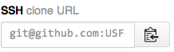

"Git on it"
=====


Git is the assembly language of revision control systems and is very hard to use from the commandline so I restrict myself to a few memorized commands. Fortunately, development environments such as intellij know how to use it and you can focus on high-level operations such as: commit, diff, pull/push from/to remote repository. To truly understand what's going on however it's best to understand the individual commands from the commandline.

## Table of contents

<!-- START doctoc generated TOC please keep comment here to allow auto update -->
<!-- DON'T EDIT THIS SECTION, INSTEAD RE-RUN doctoc TO UPDATE -->
**Table of Contents**  *generated with [DocToc](http://doctoc.herokuapp.com/)*

- ["Gitting down to business in CS601, project #1"](#gitting-down-to-business-in-cs601-project-#1)
  - [Cloning a repository](#cloning-a-repository)
  - [Adding files](#adding-files)
  - [Changing files](#changing-files)
  - [Deleting files](#deleting-files)
  - [Push your changes to github](#push-your-changes-to-github)
  - [Pulling changes from github](#pulling-changes-from-github)
- [Why use revision control?](#why-use-revision-control)
  - [Solo programmer, local disk use](#solo-programmer-local-disk-use)
  - [Solo programmer, sharing across machines](#solo-programmer-sharing-across-machines)
  - [Multiple programmers](#multiple-programmers)
- [Central versus distributed repositories](#central-versus-distributed-repositories)
- [Why git?](#why-git)
- [Concepts](#concepts)
  - [Commits](#commits)
  - [Commit messages](#commit-messages)
  - [Stash vs commit](#stash-vs-commit)
- ["Git 'er done"](#git-er-done)
  - [Pure local use](#pure-local-use)
    - [With a remote server like github](#with-a-remote-server-like-github)
- [Common operations](#common-operations)

<!-- END doctoc generated TOC please keep comment here to allow auto update -->

## "Gitting down to business in CS601, project #1"

Let's start out by looking at how you will work on the first project by cloning from your github repository within the [CS601 organization](https://github.com/USF-CS601-S15).

### Cloning a repository

Go to github and locate the repository of interest, such as your first project:

https://github.com/USF-CS601-starterkits/parrt-graph

(The pattern is USF-CS601-Fxx or USF-CS601-Sxx) where xx is the last two digits of the year and so you might have to modify it depending on the year.)

Then locate the SSH URL on the right-hand gutter of the webpage and click the clipboard icon to get it into your paste buffer:



the URL is actually something like ``git@github.com:USF-CS601-S15/parrt-graph.git`` and, to get it onto your local disk, you clone it:

```
$ cd ~/cs601/projects
$ git clone git@github.com:USF-CS601-S15/parrt-graph.git
$
```

This makes a ``parrt-graph`` directory in the current directory, which in this case is ``~/cs601/projects``. The ``parrt-graph`` directory should look like this:


You will also notice a hidden directory that contains all of the stuff needed by git to manage your repository locally:

```
$ ls .git
COMMIT_EDITMSG  ORIG_HEAD       description     info            packed-refs
FETCH_HEAD      branches        hooks           logs            refs
HEAD            config          index           objects
$
```

Technically speaking you never have to think about github ever again as you can continue to commit and modifies repository forever. Github will only ever see changes you push to it, which we will do shortly.

Similarly, if you ever want to throw this copy of the repository out with all the changes you have made, just remove the directory. You don't need to notify anybody. Certainly github does not care if you throw away a clone of its repository.

### Adding files

To add a file, such as your hash table, just create the file and notify ``git``:

```
$ cd ~/cs601/projects/parrt-graph/src/cs601/collections
$ ... create UnweightGraph.java ...
$ git add UnweightGraph.java
$
```

To commit the "change" (the addition of a file) to the repository, we ``commit``:

```
$ git commit -a -m 'add start of my graph'
[master abd47d9] add start of my graph
 1 file changed, 1 insertion(+)
 create mode 100644 src/cs601/collections/UnweightGraph.java
$
```

The ``-a`` means "all changes" and ``-m`` means message. From ``git help commit``:

<blockquote>by using the -a switch with the commit command to automatically
           "add" changes from all known files (i.e. all files that are already
           listed in the index) and to automatically "rm" files in the index
           that have been removed from the working tree, and then perform the
           actual commit;
</blockquote>

### Changing files

If you want to make a change to one of the files, just do so and do another commit:

```
$ ... alter UnweightGraph.java ...
$ git commit -a -m 'tweak my graph'
[master 7624de2] tweak my graph
 1 file changed, 2 insertions(+)
```

### Deleting files

To delete a file, just remove it with the operating system as usual and perform a commit.

```
$ rm Useless.java # assume Useless.java is already in the repository
$ git commit -a -m 'get rid of a useless file'
[master 20bddef] get rid of a useless file
 1 file changed, 0 insertions(+), 0 deletions(-)
 delete mode 100644 src/cs601/collections/Useless.java
$
```

You can also use ``git rm Useless.java``.

### Push your changes to github

We have been working on a local copy of the repository stored at github. To send our changes from the local copy to github (assuming we used ``clone`` to make the local copy), we use ``push``:

```
$ git push origin master
Counting objects: 8, done.
Delta compression using up to 12 threads.
Compressing objects: 100% (5/5), done.
...
   e5d5910..c764081  master -> master
...
$
```

The ``origin`` refers to github in our case and ``master`` is the name of the branch in which we are working. More on branches shortly.

### Pulling changes from github

If you move to a new computer, or your local copy gets wiped out for some reason, you need to pull from github any changes pushed to it that your local copy does not have. We use ``pull`` for this.

If everything is up to date, you will see the followng:

```
$ git pull origin master
From github.com:USF-CS601-S15/parrt-graph
 * branch            master     -> FETCH_HEAD
Already up-to-date.
$
```

Otherwise you will see a message saying that some changes have come down from github to your local copy.

## Why use revision control?

### Solo programmer, local disk use

If you are working solo, from a single machine, and you have a regular backup mechanism in your development environment or from the operating system like Time Machine (OS X), you can get away without a formal revision system.

There are lots of important operations that can be faked without a revision system.  It's a good idea to keep track of versions of the software that work or other milestones. In the old days, people would make a copy of their project directory corresponding to important milestones like "Added feature X and it seems to work." You can do comparisons using a diff tool in between directories.

Even working solo, revision control allows you to keep a clean master source but easily try out new features that can be merged back in if they are successful. If you are working on that feature and someone wants you to fix a bug in the released version, you can easily switch branches back to the master. Then you can fix the bug and push a new version and easily flip back to the feature branch. And you can bring in that bug fix to your feature branch from the master branch easily.

It's often the case that I decide to abandon some changes and want to revert back to where I started, whatever "started" means. Revision control makes this easy.

There are often multiple versions of a single product that you have to maintain. Keeping all versions synchronized just by comparing directories is a nightmare.

Whether your IDE does it or a revision control system does it, I find it very important to look back at recent changes to see what changes have introduced a bug. Or I decide to abandon a small piece of what's going on and flip a file back to an old version.

### Solo programmer, sharing across machines

In order to work on that software from your home machine and a laptop for example, you have to make copies. That introduces the possibility that you will overwrite the good version of your software. Or, you will forget that you had made changes on your laptop but have now made a  bunch of changes on your desktop.  Resolving things can be tricky and error-prone.

As a side benefit, pushing your repository to a remote server gives you a backup automatically.

### Multiple programmers

When you add another person to the project, people end up mailing code around but it's difficult to perform a merge. My experience watching students do this reveals that two versions of the software always appear. Both students shout that their version is better and that the other version should be abandoned.

In my experience, no matter how you try to fake multiple states of the source code and share, merging changes to work on the same code base is a nightmare.

Once in a while I go back and I look at the history of changes. Sometimes I want to know who screwed this up or I want to see the sequence of changes that I made or that were made by somebody else.

Every single commercial developer I know uses revision control at work. Every company you will encounter uses it. For that reason alone, you need to learn revision control to be functional in a commercial setting.

## Central versus distributed repositories

The [git-scm book](http://git-scm.com/book/en/Getting-Started-About-Version-Control) has a good description and illustration of how multiple computers can share a central repository of code. If you are only going to do things locally, I suppose you could get away with the original RCS (By Walter Tichy, who was a professor of mine at Purdue University!). I have also used a central repository mechanism: CSV, SVN, and perforce (p4). That is cool, but its main weakness is that losing the server means you lose all history. The central server records the database of all changes. Git and mercurial copy the entire repository and database when they clone. There is no central control. On the other hand, most of us pretend that there is a central control; i.e., github. We use it like a central repository but it does not have the single point of failure of previous systems. And with *forks*, the distributed model works extremely well. Other developers can work totally independently on a complete clone of the repository and then send *pull requests* to the original owners.

## Why git?

Because of http://github.com. Full-stop. Hg (Mercurial) is *way* simpler and would be my preference.

http://github.com adds dramatically to the benefits because of its extra functionality. We will discuss this later but forking/pull requests are insanely awesome because it makes it easy for someone to contribute to your project or for you to contribute to another one. They also have good code review facilities and issue management.

## Concepts

A git repository instance is just a directory on your disk that also happens to have a ``.git`` directory, which is effectively a complete database of everything that's happened to the repository since it was created with ``git init`` (or you ``clone``'d it).

If you want to throw out the repository, just remove the entire subtree. There is no central server to notify. Every repository instance is a complete copy so you could have, for example, 10 versions of the repository cloned from an original sitting on the same disk.

After you create a repository, you can add all sorts of files but git ignores them until you ``add`` them. When you add files or modify files already known to git, they are in the so-called *staging area* (this used to be called the *index*).  You can have whatever other files you want laying around, such as development environment preference files. Git will simply ignore them unless you add them. This is different than other revision control systems that insist upon knowing about and managing everything under a particular subtree. I like that feature.

### Commits

In concept, a commit is a snapshot of your entire repository directory subtree on the disk. In reality, the repository stores only the difference of the current stuff from the previous stuff. For binaries that changes, (likely) copying the whole thing.  The most recent commit is called the `HEAD`.

Having a complete list of changes is extremely useful. For example, here is a chunk taken out of the middle of my commits on the ANTLR repository as shown by SourceTree:


That should look very much like Time Machine on OS X to you. You can go back and look at changes made to the repository for any commit.

 You will also notice that I have tagged a particular commit as ``4.4`` with the ``tag`` command. This makes it easy for me to flip the repository back to a specific commit with a name rather than one of those funky commit checksums. Here is what that particular commit consisted of per SourceTree:


You should commit only logical chunks like feature additions, bug fixes, or comment updates across the project, etc. 

### Commit messages

Commit messages are important. Do not use meaningless messages, as I see students sometimes do:

```
Add MyFile.java
Alter MyFile.java
Alter MyFile.java
Alter MyFile.java
Alter MyFile.java
Alter MyFile.java
...
```

I have even seen git commit messages: `one`, `two`, `three`. Nothing spells laziness or academic dishonesty than that.

In rare cases, when I'm working alone, I sometimes use a private repository as a means of sharing files across multiple computers like dropbox. In this case, my commits are just to take a snapshot to pull it down on another machine. The commit message doesn't matter (though I might still look back through the changes at some point). When doing this for a real project, it's best to use ``stash`` per the next section.

### Stash vs commit

To save everything you've done in the working directory to files git is aware of, you can stash things:

```
$ git stash
```

Which will take a snapshot of your current working directory and reset the working directory to look like the most recent commit (HEAD).  You can jump around to different branches and do whatever you like then do the following to restore the state of your working directory:

```
$ git stash pop
```

to get the most recent stashed working directory. These are not committed changes. It's a temporary stack of snapshots.

Unless you really know what you're doing, make sure you are on your original branch when you `pop` or `apply` a stash. It's really just applying a series of patches so you can technically apply a stash to any branch, not just the one in which you created it.

#### Interrupted workflow

From `git help stash`:

"When you are in the middle of something, your boss comes in and demands that you fix something immediately. Traditionally, you would make a commit to a temporary branch to store your changes away, and return to your original branch to make the emergency fix, like this:"

```bash
# ... hack hack hack ...
$ git checkout -b my_wip
$ git commit -a -m "WIP"
$ git checkout master
$ edit emergency fix
$ git commit -a -m "Fix in a hurry"
$ git checkout my_wip
$ git reset --soft HEAD^
# ... continue hacking ...
```

You can use git stash to simplify the above, like this:

```bash
# ... hack hack hack ...
$ git stash
$ edit emergency fix
$ git commit -a -m "Fix in a hurry"
$ git stash pop
# ... continue hacking ...
```

## "Git 'er done"

### Pure local use

**Create repo.** All you have to do is create a directory, and then run:

```
$ cd test
$ git init
```

and you have a git repository.

**Adding to repo.** Then you just add files and do a commit

```
$ cat > t.c
$ git add t.c
$ git commit -a -m 'initial add'
```

**Make changes.** Then you can make changes and do another commit. Make sure use the ``-a`` command.  By the way, deleting a file is also considered a change but you can also use ``git rm file.c``.

**Checking differences with repo.** If you make a change and want to know how it's different from the current repository version, just use diff:

```
$ ... tweak t.c ...
$ git diff t.c
...
```

**Reverting.** If you screw up and want to toss out everything from the last commit, do a reset and make sure you use the hard option:

```
$ ... tweak whatever you want ...
$ git reset --hard HEAD
```

which throws out all changes since the last commit. If all you want to do is revert uncommitted changes to a single file, you can run this:

```
$ git checkout -- filename
```

I *think* they call that funny ``--`` thing "sparse mode." See? Git is the assembly code of revision systems.

**Correcting commit message.** One of the other things I often have to do is to [fix the commit message](http://stackoverflow.com/questions/179123/edit-an-incorrect-commit-message-in-git) that I just wrote in a commit command.

```
$ git commit --amend -m "I really wanted to say this instead"
```

**Adding file you forgot to commit.** If you forgot to add one of the files and you wanted in a previous commit, you can also use amend. Just add the file and use amend:

```
$ git add t2.py
$ git commit --amend --no-edit
```

**Checking working dir and staging area vs repo.** Finally, if you want to figure out what changes you have made such as adding, deleting, or editing files, you can run:

```
$ git status
On branch master
Your branch is up-to-date with 'origin/master'.

Untracked files:
  (use "git add <file>..." to include in what will be committed)

	.idea/
	tests/

nothing added to commit but untracked files present (use "git add" to track)
$
```

#### With a remote server like github

When you're working by yourself and without branches, a remote server acts like a central server that you can push and pull from. For example, I push from my work machine and pull to my home machine or my laptop. And then reverse the process with changes I make at home over the weekend.

To begin the process of working from a remote server, we clone from that server. For example, from github, I can clone my build system called ``bild``:

```
$ cd ~/projects
$ git clone git@github.com:parrt/bild.git
...
```

which will create a ``bild`` directory in my ``projects`` directory.

Once I have commit all of my changes and I'm ready to go home, I push to the origin:

```
$ git push origin master
```

From home, I do:

```
$ git pull origin master
```

The ``origin`` is the alias for the original server we cloned from and ``master`` is our master branch, which we can ignore until we look at branches.

To look at the remote system alias(es), we use:

```
$ git remote -v
origin	git@github.com:parrt/bild.git (fetch)
origin	git@github.com:parrt/bild.git (push)
$
```

## Common operations

After ``grep``ing through much of my bash history (I use git from command-line often), I see the following commands / operations: ``add``, ``branch``, ``checkout``, ``commit``, ``config``, ``diff``, ``fetch``, ``log``, ``merge``, ``pull``, ``push``, ``remote``, ``reset``, ``rm``, ``stash``, ``status``. A histogram shows different things depending on what I'm doing. When I'm working on course materials like this, I see almost exclusively ``commit``, ``push``, ``add``, and ``pull`` as I tweak things, push them to github from work, and then pull them in from home.

When developing code, I primarily ``push``, ``pull``, ``branch`` (asking what branch I am in), ``commit``, ``add``, ``checkout`` (switch branches), ``remote`` (check which server I am talking to), and then a few ``fetch`` and ``reset`` commands. I do a lot of ``diff`` but usually from within my development environment so that is not shown in the commandline history.


