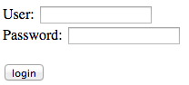

# HTTP

## Protocol

[HTTP protocol](http://en.wikipedia.org/wiki/Hypertext_Transfer_Protocol)

[HTTP Status codes](http://en.wikipedia.org/wiki/List_of_HTTP_status_codes)

* 200 OK
* 403 Forbidden: The request was a valid request, but the server is refusing to respond to it.
* 404 Not Found
* 400 Bad Request
* 302, 303, 307,308: redirections

```
GET / HTTP/1.1
Host: localhost:8080
Connection: keep-alive
Cache-Control: max-age=0
User-Agent: Mozilla/5.0 (Macintosh; Intel Mac OS X 10_7_3) AppleWebKit/537.1 (KHTML, like Gecko) Chrome/21.0.1180.89 Safari/537.1
Accept: text/html,application/xhtml+xml,application/xml;q=0.9,*/*;q=0.8
Accept-Encoding: gzip,deflate,sdch
Accept-Language: en-US,en;q=0.8
Accept-Charset: ISO-8859-1,utf-8;q=0.7,*;q=0.3
Cookie: JSESSIONID=1bq43ly99qm9vs4iqjq1rkfrh
<empty line ends header list>
```

```
$ telnet cnn.com 80
Trying 157.166.226.25...
Connected to cnn.com.
Escape character is '^]'.
GET / HTTP/1.1
Host: www.cnn.com

HTTP/1.1 200 OK
Server: nginx
Date: Fri, 14 Sep 2012 18:59:33 GMT
Content-Type: text/html;charset=UTF-8
Transfer-Encoding: chunked
Connection: keep-alive
Set-Cookie: CG=US:CA:San+Francisco; path=/
Expires: Fri, 14 Sep 2012 19:00:33 GMT
Cache-Control: max-age=60, private
Vary: Accept-Encoding, User-Agent
X-UA-Profile: desktop

eae
<!DOCTYPE HTML>
<html lang="en-US">
<head>
...
0
```

New lines are \r\n not just \n in HTTP

If no `Content-Length` use socket close for size.

Chunked transfer as in cnn above uses a chunk size of 0 to mark the end of the content.

Here is what our CS webserver responds with to a fetch of main page:

```
$ telnet www.cs.usfca.edu 80
Trying 138.202.170.2...
Connected to www.cs.usfca.edu.
Escape character is '^]'.
GET / HTTP/1.1
Host: www.cs.usfca.edu

HTTP/1.1 200 OK
Date: Fri, 14 Sep 2012 19:17:31 GMT
Server: Apache/2.2.3 (CentOS)
Accept-Ranges: bytes
Content-Length: 45818
Connection: close
Content-Type: text/html; charset=UTF-8

<?xml version="1.0" encoding="utf-8"?>
...
```

## Virtual host stuff

wikipedia:
> The "Host" header distinguishes between various DNS names sharing a single IP address, allowing name-based virtual hosting. Host is optional in HTTP/1.0 but mandatory in HTTP/1.1.

```
$ telnet antlr.org 80
Trying 138.202.170.10...
Connected to antlr.org.
Escape character is '^]'.
GET / HTTP/1.1
Host: www.antlr.org

HTTP/1.1 200 OK
Date: Fri, 14 Sep 2012 20:24:32 GMT
Set-Cookie: JSESSIONID=EFFE17C98AF00C3147D0D11336BD4016; Path=/
Cache-Control: no-store
Expires: Thu, 01 Jan 1970 00:00:00 GMT
Pragma: no-cache
Content-Type: text/html; charset=UTF-8
Connection: close
Transfer-Encoding: chunked

1ff8
<!DOCTYPE HTML PUBLIC "-//W3C//DTD HTML 4.0 Transitional//EN">
<html>
<head>
 <title>ANTLR Parser Generator</title>
...
```

then, using www.stringtemplate.org, we can get to same IP but get different response. (Note: i have moved these sites since this output was captured.)

```
$ telnet stringtemplate.org 80
Trying 138.202.170.10...
Connected to antlr.org.
Escape character is '^]'.
GET / HTTP/1.1
Host: www.stringtemplate.org

HTTP/1.1 200 OK
Date: Fri, 14 Sep 2012 20:25:37 GMT
Set-Cookie: JSESSIONID=B0361655BC4E9F185FEF41530AA4CA19; Path=/
Cache-Control: no-store
Expires: Thu, 01 Jan 1970 00:00:00 GMT
Pragma: no-cache
Content-Type: text/html; charset=UTF-8
Connection: close
Transfer-Encoding: chunked

1ff8
<!DOCTYPE HTML PUBLIC "-//W3C//DTD HTML 4.0 Transitional//EN">
<html>
<head>
 <title>StringTemplate Template Engine</title>
...
```

## POST

GET gets data and POST submits data. These are 2 most common.

```
<html>
<body>
<form method=POST action="http://localhost:8080/">
User: <input type=text name=user><br>
Password: <input type=password name=password><br><br>
<input type=submit value="login">
</form>
</body>
</html>
```

Which looks like:



Entering `parrt/foobar` yields this traffic to server:

```
~/github/cs601/lectures/code/sockets $ j Server
POST / HTTP/1.1
Host: localhost:8080
Connection: keep-alive
Content-Length: 26
Cache-Control: max-age=0
Accept: text/html,application/xhtml+xml,application/xml;q=0.9,image/webp,*/*;q=0.8
Origin: null
User-Agent: Mozilla/5.0 (Macintosh; Intel Mac OS X 10_9_4) AppleWebKit/537.36 (KHTML, like Gecko) Chrome/37.0.2062.94 Safari/537.36
Content-Type: application/x-www-form-urlencoded
Accept-Encoding: gzip,deflate
Accept-Language: en-US,en;q=0.8

```

Send using email:

```
<form action="mailto:joe@antlr.org" method="POST">
Name: <input name="name" type="text" /><br />
<input type="submit" value="send" />
</form>
```

Uploading file:

```
<FORM METHOD=POST ACTION="/submit/process" ENCTYPE="multipart/form-data">
...
</FORM>
```

## Redirection / moving URI

Google recommends 301 response to move pages etc...
From wikipedia for a moved page:

**Client request:**

```
GET /index.php HTTP/1.1
Host: www.example.org
```

**Server response:**

```
HTTP/1.1 301 Moved Permanently
Location: http://www.example.org/index.asp
```

During server development can send type of redirect you want. For java sendRedirect(), I'm pretty sure it uses code 302 but you can use 303 See Other, which strips POSTs to just GETs. These redirect codes are all confused in practice.

```
response.setStatus(307);
response.setHeader("Location", "http://other.com");
```

## Secure socket layer (SSL)

A way to securely send data between 2 machines, usually a client and server. Now called TSL. A tunneling proxy at application layer between client/server.

Port 443 for HTTPS, not 80.

Basically, the client and server do a handshake to create a "session key" that they used to encrypt and decrypt information going across socket. Must agree on that session key by transmitting data in the clear, however. "Key exchange" can be done securely with diffie-hellman, RSA, a few others. DH does not guarantee authenticity, just a way to get a session key to then make a secure channel.

[public-private keys](http://www.silvanschmid.com/gnupg.php)


Only difference is that we need a way to apply two encryptions in one order then decrypt in different order.  Fancy math handles this.

## Jetty

[jetty](http://www.eclipse.org/jetty/) is a simple embeddable or standalone web server for static pages or dynamic pages like JSP or Servlets. For our purposes, it's probably easier to have your application embed the web server directly.
