jGuru.com Case Study
====

_Terence Parr_, October 31, 2002.

The jGuru server is the culmination of 3 years of experimentation and frantic implementation.  These notes summarize how jGuru's design and implementation changed over time from a slow, cranky, and unreliable website to an extremely fast, stable, and popular website for Java developers.  I do not discuss how the software is implemented; I focus on the overall system configuration and design.

# A Pictoral History of jGuru

Thanks to the [Wayback machine](http://www.archive.org) at the Internet Archive, here is a visual track of the jGuru "look-n-feel" including links to the archived pages ([See whole archive](http://web.archive.org/web/*/http://www.jguru.com)).

## Chronological

|Date | Preview | Archive Link|
|--------|--------|--------|
|Dec 06, 1998 |  | [archive](http://web.archive.org/web/19981206172412/http://www.jguru.com)|
|Jan 25, 1999 | 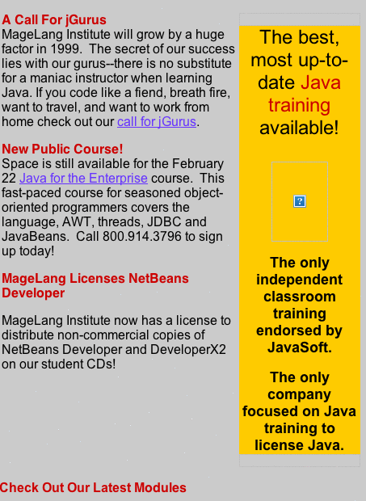 | [archive](http://web.archive.org/web/19990125101001/www.magelang.com)|
|Nov 9, 1999 | 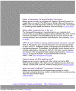 | [archive](http://web.archive.org/web/19991109003940/http://www.jguru.com)|
|March, 2000 |  | [archive](http://web.archive.org/web/20000303093944/http://www.jguru.com/portal/index.jsp)|
|May 11, 2001 | 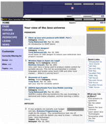 | [archive](http://web.archive.org/web/20000511023122/http://www.jguru.com/portal/index.jsp)|

## Multiple Sites and multiple "skins"

jGuru can pump out multiple websites (called "multi-tenant" system now) using the same server (same Java VM process).  Here is a list of different "tenants" viewing subsets of the same data.  Each site can have a different landing page (faq index page for BEA, webGAIN) and can see a different list of topics.  jGuru had different "skins" for guest, user, and premium users.

Note that the premium site has one gutter.  BEA has two on the left.  webGAIN has two (on opposing sides).

| Look | Preview |
|--------|--------|
|Premium | 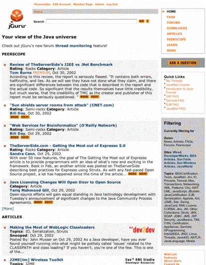|
|BEA | 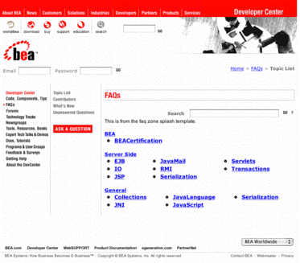|
|webGAIN | 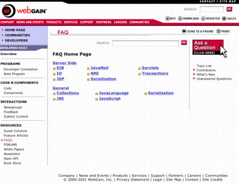|


# Original Overall System

## Machines

We had a random collection of dissimilar boxes running various flavors of linux (redhat).

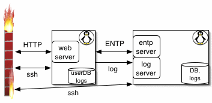

## Software

We had loads of various pieces of software:

* apache
* jserv
* gnujsp 0.9.10
* epicentric (a portal server purchased for big $$$)
* mysql 3.22.25
* solid (2 of them), one for apidb and one for data
* solid jdbc driver
* java JDK 1.2
* jsdk 2.0
* httpclient
* mysql jdbc driver
* thunderstone search engine (added after initial system)

The software had config interdependencies like crazy (and between versions).  Heck JSP syntax changed TOTALLY during our use of it.  I built a script to convert it.

We had multiple versions of the software on each machine.  Then used a sym link "knob" to switch between dev branches, release branches, test branches, and of course the live server.  The [Perforce revision system](http://www.perforce.com) was used to deploy software.  In other words, I would go to the web server and say "sync with repository" and hope for the best.

### Web machine

Apache was our http server but since we had nothing but dynamic JSP pages, apache served no purpose other than to invoke gnujsp via jserv.

The epicentric portal server managed our users and provided the basic functionality.  You could configure which little window-like boxes (news, faqs, ...) you wanted on your pages.

Epicentric insisted we use mysql, which couldn't do transactions, hence, for our data (faqs mostly) we bought a [SOLID](http://www.solidtech.com) database.  Excellent and simple.  Backup is "copy a file".  The web server communicated with the SOLID database via an English and xml-based ENTP (_Entity Transfer Protocol_) client that talked to an ENTP server on the database machine.  The results of queries were cached.  Since queries always differ slightly, there was lots of repeated data and the cache had to be big to get good performance.

Eventually we purchased Thunderstone's search engine.  That was slow to spider our site, as in days, due to the inefficiency of the site and inefficiency of going through HTTP to get data.  [Current system does it in 20 minutes].

We had a javadoc API searcher that was semi cool; used another (local) copy of SOLID to hold the info.  Written by an "intern".

### Database machine

We had an ENTP (_Entity Transfer Protocol_) server answer queries from the web server.  If this was down, the web server would freeze.

The schema was such that queries took *forever* sometimes (as in an hour).  I had each property of a Java object mapped to its own table in the database rather than all the single-valued properties in one table and then one table per multi-valued properties.

I believe we copied the database to a backup "hot swap" database every hour so we'd lose at most 1 hours worth of data if everything died.  Main database server was a RAID disk though.

## Installation and configuration

To install a new system, we manually configured, compiled, set property/config file values etc...  No rpm to just dump stuff on a system.  Computers were different too.  Some directories were different or whatever (different redhats).  This process took 4 hours once you had done it 3 or 4 times.  Never went smoothly though.

The nastiest part was making sure the config files were set correctly, and that file permissions were set properly.  Component interaction was always a problem.  We had config files everywhere: our software and everyone else's!  For example, we had to change machine names and so on in all these files

```
     /usr/local/apache/conf/httpd.conf     
     /usr/local/apache/conf/jserv.conf
     /usr/local/apache/conf/jserv.properties
     /usr/local/jserv/zones/root/zone.properties
     /usr/local/portalserver/config/properties.txt
```
     
Sys admin wanted data grouped by static vs changing data rather than logically like "apache", "db", etc...  This is madness because when there is a problem with apache, I want to jump to an apache dir and then look at the logs, config, etc...  Worse, it was hard to put the config files into the repository since lots of it had to live up in `/etc/rc.d/init.d` etc... (not under the perforce root).  Used lots of sym links pointing all over the system.

We had to have lots of cron jobs too:

* to rotate logs
* do backups
* run site spidering scripts
* run maintenance scripts for the server
* run statistics scripts

All this installation process was by hand so:

* slow
* prone to error
* no two machines alike

Also, because we used RCS to deploy and didn't have RPMs for system components, we were tempted to modify software on web/db servers, rendering our boxes slightly different.  Should be deployed as readonly systems.

All of this made it difficult to debug:

* no reproducibility for testing
* bug catching

You had no confidence that "_because it works on the test box, it will work on the live server_".

*How do I remember all this old info?* I have notebooks (text files) used to record experiments and communicate things to others and myself (in future).

## Security holes

We had telnet open, bind, sendmail...everything.  Got hacked at xmas one year because someone snooped my telnet session.

## Data

On the web server, we had

1. mysql db for epicentric
1. solid db holding API database
1. apache web server logs
1. epicentric portal server logs
1. web server application debugging info
1. cron job logs

On the database server, we had

1. SOLID database holding faqs, ...
1. app server logs like login, trampoline, ...
1. every ENTP db query request
1. cron job logs

# Second (Phoenix) System

As things turned out, I ended up writing the entire second implementation of jGuru.  The old system had decayed so horribly internally that we needed to completely rewrite the system.

Experience with Epicentric and also JSP led us to believe we should dump them, necessitating construction of lots more software.

## Machines

Because the first system was such a pig, we figured we need a cloud of webservers all connected to a fast database machine as follows:

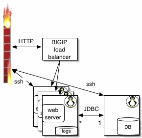

We bought lots of hardware and then realized that the new software was really fast (and we could turn the compiler on now that linux threads worked).  So, the new system ended up with one web server connected to a dedicated database machine:

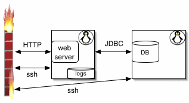

This system, a dual 800Mhz 1G RAM linux redhat 7.2 box, is *mostly idle* with spurts of heavy Java and database activity occasionally as the software reloads data into the services like `FAQManager`.

When money ran low, we dropped the db machine rental and moved the DB physically to the web server with no perceptible loss in performance.  Thanks to JDBC we only had to do the data move and change a URL property:

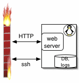

## Security

Currently we have only ports 80 and SSH open to our live server at Rackspace and SSH only accepts connections from behind the firewall at our dev network.  The dev network in turn has NO ports open.  None.  Makes for a very tough nut to crack.

We put our pop/email server on a net that is totally disconnected from our private dev network.  I'm just waiting for POP server to be hacked.  Even if they get in, however, they cannot touch our private net that sits 1 foot away on the desk. :)

## Software

Amazingly, we have boiled down jGuru to only a few system components.  Further, everything is in Java now except for the SOLID database, reducing our system dependencies and configuration hassles tremendously.  Technically speaking we could deploy with a whopper of a jar file once Java and the DB were installed.

The new components are:

* resin (does html, jsp, servlets)
* solid
* solid JDBC driver
* JDK 1.3
* httpclient (used by snoopers)
* lucene search engine

## Installation and configuration

When bringing the new Rackspace boxes online, I made a "human script" that turns off all the major security holes; now it takes only a few minutes to execute.

From there, I install the JDK, SOLID (optionally with data), and resin RPMs.

To get the software on the live box, I "push" using `rsync` from my dev box to the live server.  This guarantees that the live server is "identical" and that I won't be tempted to mess with the server config, making the two systems diverge.

Everything minus the security lock down is automatic and quick.

When the software starts up, it senses its environment and builds directories, search databases, etc... if necessary.

I have moved cron-type jobs (stuff that runs periodically) into Java as well to avoid having to set up OS crontabs and the like. 

From a box offsite, I run a backup script (cron) that pulls the db over daily to another hard disk.  Logs as well.  I also run statistic generating scripts on this box.

## jGuru Database Schema

Here is an image (built thanks to Ladd Angelius) showing all of the jGuru database tables (minus relationships, which are implied by the software):

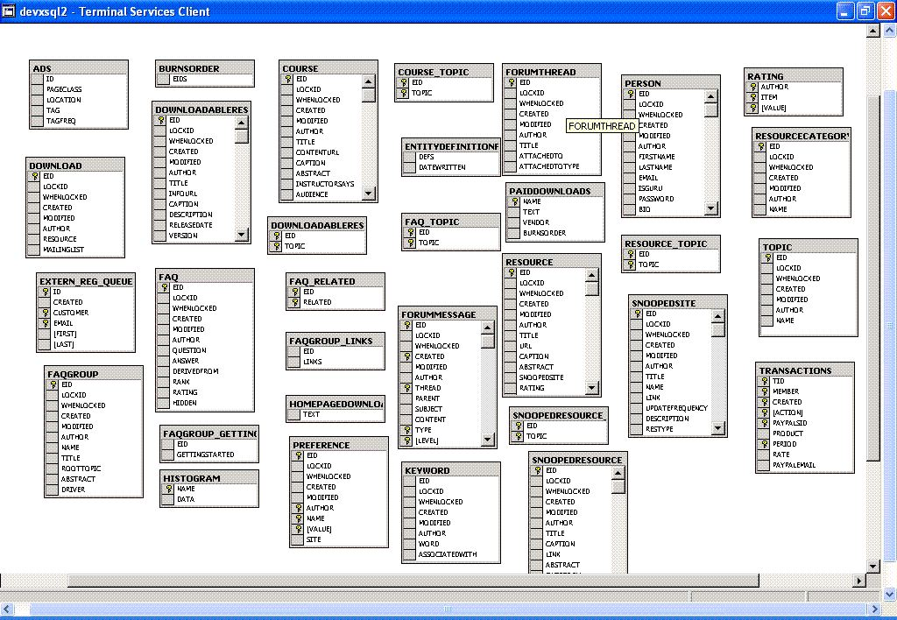

# Software Evolution

Developing big programs is just a big fat mess.  You are constantly making decisions with incomplete information and then having to live with the consequences far into the future.  The most important bit of advice I can give you is that you should write software with this in mind.  Don't optimize early or get too smart about how the future will go.  On the other hand, you can't make your software too brittle.  You'll regret it.  If the market doesn't change your direction or target for you, your boss randomly will.

## Changing database schemas

The one thing you know will change a lot as you enhance a website is your database schema.  Java deals with objects and, unless you have an object db, you must map your objects onto a set of tables for a relational database.  The first thing I did was to build a simple entity specification language that knew how to map things to and from the database.  When I change the properties of my objects, I only change the Java object def and the entity spec.  The database code automatically knows how the object will map to the database.  Here is my FAQ entity spec in my little language:

```java
/* A FAQ entry.  All entries are mixed together. The topics array
 * determines what FAQ an entry goes with.
 */
entity FAQ {
    required property text question    
        : linkTextProperty=true, pickListProperty=true
        ;
    property text answer;    

    /** Normally this refers to an orphan from which this entry    
     *  was generated, but in principle it could be an article.    
     */    
    property Entity derivedFrom;    

    property Topic topic[];    

    /** rank in popularity */    
    property int rank;    

    /** how good is this entry? 1..5 */    
    property int rating;    

    /** which entries strongly correlated with this entry? */    
    property FAQ related[];    

    /** Admin's can hide this sucker */    
    property boolean hidden;    
}
```

Note that I let you use array notation and then the software automatically builds extra tables (using 3rd normal form or whatever it is) to handle the multi-valued property.

I use a simple query language in my `EntityDB` object to request data.  It asks the entity definition symbol table to determine how to translate it to SQL.  E.g.,

```
query type FAQ props (question,answer) where "author=1" 
```

## Page Generation

Per our previous classes, you know how my page management system evolved from:

1. JSP; uses includes instead of inheritance

1. Servlets.  One servlet per page with a `Page` superclass to factor out common functionality.  Each page printed HTML directly except for the headers and tried to put some common things into `JGuruBulletList` objects etc...

1. Had to have "skins" per user so I made everything use templates.  Now the software can use any number of skins and can even generate multiple websites using the same process!  For example, I have site config files like this:
```java
// this file is $HOSTNAME.family and defines what sites can run
family {
        master = "jguru";
        sites = { "jguru", "premium" };
}
```
Then I have site defs like file `sites/jguru/jguru.site`:
```java
site jguru answers "www.jguru.com" {
  aliases = { "jguru.com", "magelang.com", "www.magelang.com" };
    zones = { "Home", "FAQs", "Forums", "Downloads",
              "Articles", "Peerscope", "Learn", "News" };
  ...
```
1. Finally, I arrived at having a single page act like a state machine and pass a `node` argument to that page to simulate going to another page.  Reduced number of Java files, encapsulated functionality, easier to understand, more maintainable, etc...

Note that for the config files, I don't have to specify anything at start up...I just say "run!".  It looks at the hostname to determine what family of sites to bring up.  This is superior to having to say the right thing.

