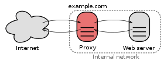

Proxy Servers
=====

See also [Wikipedia entry on proxies](http://en.wikipedia.org/wiki/Proxy_server).

A tunneling server that:

* Responds to GET protocol commands that name the full URI of the target resource:
``GET http://xyz.com/foo HTTP/1.0``
* Responds to POST protocol commands, which passes the request body to the target resource:
``POST http://xyz.com/foo HTTP/1.1``

From this command, the proxy strips the hostname from the URI and passes the command onto the remote server as command:

```
GET /foo HTTP/1.0
```

for example.

To figure out how proxies work without screwing up your browser proxy settings, you can use curl:

```bash
curl --proxy localhost:8080 www.antlr.org
```

Note that in regular HTTP servers, the http://xyz.com/ part is in the Host: header.


Parameters for GET are in URI. For POST, they come as data elements after header + blank line:

```
...
Content-Type: application/x-www-form-urlencoded
Content-Length: 11

q=foo&x=bar
```

Useful for:

* hiding machines; proxy does all of the outside requests
* speed: proxies can cache commonly requested resources, increases bandwidth
* track and/or block user access
* sniff/scan data going out or coming in
* circumvent government web restrictions; I had to ssh to my box from Guangzhou to access a website once. All you need is a machine outside of the firewall. Set it up as a proxy to access the outside world and then have your browser pointed it.
* Wikipedia: "*To allow a web site to make web requests to externally hosted resources (e.g. images, music files, etc.) when cross-domain restrictions prohibit the web site from linking directly to the outside domains.*"   For example, JavaScript ajax programming wants to access twitter APIs, but security restrictions typically prevent this. Most JavaScript code can only access the server from which it comes.

## Headers

The proxy must collect all of the headers obtained from your browser and pass those along in its request to the remote server. Similarly, the headers received by the proxy from the remote server should be sent back to the browser as part of the response.

Here is what I get back from antlr.org

```bash
$ telnet www.antlr.org 80
Trying 138.202.170.10...
Connected to www.antlr.org.
Escape character is '^]'.
GET / HTTP/1.1
Host: www.cs.usfca.edu

HTTP/1.1 200 OK
Date: Tue, 30 Aug 2011 17:53:02 GMT
Set-Cookie: JSESSIONID=901C40246D69C9129E4AF7376B4553E1; Path=/
Cache-Control: no-store
Expires: Thu, 01 Jan 1970 00:00:00 GMT
Pragma: no-cache
Content-Type: text/html; charset=UTF-8
Connection: close
Transfer-Encoding: chunked
...data...
```

## Algorithm

To process a single request, the basic algorithm was like this:

1. get first line from browser, split into the command, the URI, and the HTTP version;
e.g., "GET http://xyz.com/foo HTTP/1.0"
1. read in headers until we see a blank line; force the header names to lowercase and put the name-value pairs into a map
1. strip out user-agent, referer, and proxy-connection headers
1. strip out connection header if its value is keep-alive
1. parse the URI to strip out the host and get the "file" name like /foo
1. open a socket at port 80 at the remote host
1. send it the same HTTP command that you got from the browser except make the version 1.0 not 1.1 so we don't have to worry about chunking and use the file name not the entire URI
1. then send the remote host all of the headers we got from the browser minus the ones we deleted
1. if POST, get the content-length header from the browser and copy the data following the browser headers to the socket to the remote host
1. read the response line from the remote host like "HTTP/1.0 200 OK"
1. send it back to the browser
1. strip out connection header from the remote host response headers if its value is keep-alive
1. send remote host response headers back to the browser
1. read remote data and pass it back to the browser

Some servers and browsers use different cases, normalize your headers to all be lowercase. I tried this in my solution and it seems to work.

This algorithm does not deal with keep-alive connections. It forces browsers and servers to do one socket connection per request. Despite buffering input and output streams, browsing with my proxy is significantly less performant than without the proxy.

This mechanism handles all of the redirects and caching stuff with no problem. For example, in response to request

```
GET http://pagead2.googlesyndication.com/pagead/show_ads.js HTTP/1.1
```

The remote server might return

```
HTTP/1.0 304 Not Modified
```

which we can send directly back to the browser.

## Reverse proxy

A reverse proxy often acts like a load balancer and allows clients from outside of the company to access multiple resources from outside the firewall. A request to the reverse proxy triggers an internal request to the company's servers; that data is returned to the client. These kind of proxies can also do filtering and so on.



A proxy server connecting the Internet to an internal network.

Reverse proxies can also have SSL acceleration hardware that removes the burden from the actual Web servers behind them.

## Network address translation vs Proxies

NAT is the stuff that your Internet cable modem router does to convert an outside public address to an internal private address like 10.0.0.1 or 192.168.0.5. All internal addresses flip to a single external address for outgoing traffic. That is done at the network layer whereas proxies are done at the application layer. Literally an application on the server is deciding to forward a request to another server.
