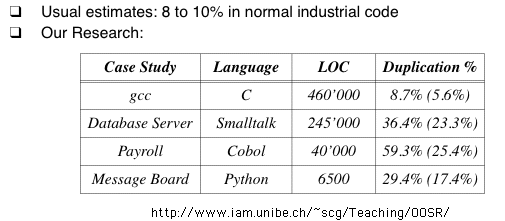

Code Refactoring
====

Until you've had to live with the same piece of code for a while, you will not experience the need for refactoring.  This lecture tries to summarize what refactoring is, when you need to do it, what patterns and tools are available.  Further, I provide some jGuru examples to illustrate some of the concepts.

These lecture notes paraphrase or quote much content from [Martin Fowler's Refactoring Book](http://www.amazon.com/exec/obidos/ASIN/0201485672/002-9330989-7896037).

Fowler:

<blockquote>
  "Any fool can write code that a computer can understand.  Good programmers write code that humans can understand."
</blockquote>


# Refactoring?

## What?

Fowler says that refactoring is the

<blockquote>
... process of changing a software system in such a way that it does not alter the external behavior of the code yet improves its internal structure.
</blockquote>

In other words, just cleaning up code. Contrary to waterfall development strategy, for example:

1. analysis and design
1. code
1. test

At first, code is pretty good but as requirements change or new features are added, the code structure tends to atrophy.  Refactoring is the process of fixing a bad or chaotic design.

Amounts to moving methods around, creating new methods, adding or deleting classes, ...

TJP: Sometimes it means completely redoing the entire code base (i.e., throwing stuff away).  But, avoid the _second system effect_!

## Why?

Improve code structure and design

* more maintainable
* easier to understand
* easier to modify
* easier to add new features

Cumulative effect can radically improve design rather than letting it slide into decay.

Flip-flop code development and refactoring.  Only refactor when refactoring--do not add features during refactoring.

TJP: kind of like an immune system that constantly grooms the body looking for offensive and intrusive entities.

Bad code usually takes more code to do the same thing often because of duplication:



TJP: from Fred Brook's "mythical man-month" remember that conceptual integrity is one of his big points.  Addition of new features can break current system conceptual integrity.  Must refactor your concept sometimes as well as your code to make it fit properly.  For example, I integrated page snoopers with search so that I could look for keywords regardless of whether the source was local or on some other page or other some other site's search engine.

Improving design then often includes removing duplicate code.  Don't want duplicates because of bloat and also you only want one place to change functionality not multiple.

Fowler says he will refactor existing code just to understand it better and sometimes it helps to find bugs. TJP I'm not sure I agree with this, unless of course the code needs re-factoring.

In summary, refactoring helps you develop better code, faster!

Kent Beck:

<blockquote>
Programs have two kinds of value: what they can do for you today and what they can do for you tomorrow.
</blockquote>

Mostly we are focused on today, but you cannot code today so that you cannot code tomorrow.  Actively making the future smoother is a great idea.  When you find tomorrow that today you made a mistake, you use refactoring to fix the decision.

Fowler says database refactoring is super hard.  TJP: things like my entity specifications for jGuru can help.

### When?

When you can't stand the code anymore or it becomes impossible to add new features or fix bugs.

When your boss isn't looking. ;)  There is a lot of pressure not to do work that adds no functionality--shortsighted.

Rule of 3 from Don Roberts:

<blockquote>
The first time you do something, you just do it.  The second time you do something similar, you wince at the duplication, but you do the duplicate thing anyway.  The third time you do something similar, you refactor.
</blockquote>

Refactor when

1. you add new features and the code is brittle or hard to understand.  Refactoring makes this feature and future features easier to build.
1. you fix bugs.
1. during code review.

### When not to refactor?

1. Sometimes you should throw things out and start again.
1. Sometimes you are too close to a deadline.

## jGuru experience

TJP: Locally-inoptimal refactoring-detours generally lead to a more optimal global solution.  From personal experience, I can say that refactoring is absolutely and totally required to develop a large piece of software in the face of an ever-changing list of features.

*Example 1*: I started with a /search/results.jsp page that worked well for the single task.  Then, had to show only some stuff for nonpremium folks.  Then had to show a "marketing" version of the page.  Finally it was too damn much--couldn't read the code and literally couldn't make it work in all combinations.  After factoring out basically functionality and making separate pages that used the common functionality, I was able to quickly break apart results.jsp into 3 pages that were obvious.

*Example 2*: We started out using a search engine by thunderstone.

1. An employee coded some scripts in Thunderstone's proprietary xml-based programming language to do the right thing when we went to a particular page.  He parsed the results in Java and then displayed it on a jguru-style page.  So far so good.

1. Then we wanted to search other people's sites like slashdot, ibm, sun, etc...  The employee wanted to use the Thunderstone language to grab, parse, and return a simple list of results that can be easily reparsed by jguru and displayed in a jguru page.  I vetoed this suggesting that he get everything into a set of Java classes that did the same thing but that would integrate better into our Java code.  Even though it was more work, I suspected we'd reap a benefit later.  Further, I don't like be tied to a particular tool.  After the effort, we had some "search resource" type objects that could do searches (either remotely or locally via Thunderstone) and display them on jGuru.  We didn't treat our local search differently than a Slashdot search.  Cool!  Sounds good.

1. At this point, we also had some random code lying around that snooped other people's websites for articles.  Bad.  Getting a list of articles is same as getting list of search results (just different remote page).  Duplicated code etc...  Oh well.  We left it.

1. Sure enough, we decided to get rid of thunderstone.  My advice was worth it because no "user level" code changed to incorporate Lucene (new engine).  Yeah!  Unfortunately, there was a huge amount of code duplication among the snooper and search spiders.  I combined these into a nice hierarchy and common functionality.  Now, just about anything can pretend to be a source of search results or snooped information.

1. So then we decided to not do remote searches because everybody else's search engines are so slow and we had lots of them to search.  So, I added code to occasionally walk foreign (remote) sites to get their content (and only the good stuff) and add it to a local Lucene search database.  We get better and faster results because of this, but...

1. Current smelly code: snooper does not add things to search db...I have separate code that fills the foreign search db.  This is because you need the article list and search db to operate independently.  Still, it would be better if the same code did both the snooping and the search db updates.

*Example 3*: An employee built a prototype forum manager.  It had evolved over months and had naturally decayed in code beauty.  I rewrote (since I was only coder employee then) to be better designed and fast etc...  Boy was the new thing beautiful.  Well, as we added more features and so on, it got uglier and uglier.  Still I left it.  Then we realized it was taking forever at start up because it loaded all forum messages up front.  Ok, so I finally redesigned it to load last 3 months worth and do others dynamically.  Actually I knew that I would eventually have this "popularity" problem and it was hanging over me all the time.  Now I don't worry about it. :)

# Re-factoring Patterns TJP likes

I use [Intellij's re-factoring tool](https://www.jetbrains.com/idea/features/refactoring.html).


* [Extract Method](http://www.refactoring.com/catalog/extractMethod.html)
* [Pull up method](http://www.refactoring.com/catalog/pullUpMethod.html)
* [Pull up field](http://refactoring.com/catalog/pullUpField.html)
* Inline method
* Change method signature
* Rename variable, method, class, etc..
* Introduce constant
* Introduce variable
* Move method, static field, class, interface
* [Extract interface](http://refactoring.com/catalog/extractInterface.html)

Useful code generation templates:

* implement methods from interface/superclass
* override method
* generate getter/setters for instance variables
* generate constructor
* generate toString

_Renaming_ is a great idea because code should communicate clearly and variable names are super important (imagine a program where everything is `v1`, `v2`, ...; that is what obfuscaters do).

My first impression was that all of this was not very useful (coming from emacs), but I have come to really rely on the power of these operations.  For example, change method signature changes every reference to that method even for messages to all subclasses of the method's class you change etc...

# Example re-factoring

Refers to [Sample Http Client code](https://github.com/parrt/cs601/blob/master/lectures/code/refactoring/MyClient.java).

Kind of a stream of consciousness as I sniff the code:

Copy MyClient to FooClient or something like that.

1. Rename to HttpClient
2. Move ServerSideJava to a non-nested interface (pull up)
3. Select all, then adjust indentation
4. Rename ErrorManager() to errPage
5. Simplify expression in indexFileHandler() the checks equal to true; there are actually a bunch of those. a simple replace "== true" with "" would work.
6. Rename parameter contentIn in the page methods to message or msg.
7. Extract method: getContentTypeHeader from downloadFile.
8. Notice that `FileInputStream inFile` is not closed; and `try-finally`.
9. Think about moving closeAll() out of download file because it is not a method that does the open. Use "find all references" and noticed that there are about eight or nine. This is a prime example of unstructured programming. Ideally there should be one spot to open and another spot to close socket connections, preferably symmetrically in the same method. Obviously everybody goes all the way back to run() so let's move it there is a `finally` clause.  Yep, now only one is necessary.
10. This makes me start thinking about those fields. `p` is not a very good name; at least we can change it to `pout`.
11. Whoa, I see an element in the stream pipeline that will not be closed because there's no reference to it. Likely this is not a problem as closing the outermost pipe element will close all the intermediary pipes, but for cleanliness let's introduce a variable here:
```java
buf = new BufferedReader(new InputStreamReader(in));
```
becomes
```java
InputStreamReader isr = new InputStreamReader(in);
buf = new BufferedReader(isr);
```
12. This creates a local variable and then we notice that not all of the fields are needed. Whoops.  All of the methods reference `pout`, after renaming, except the download file references `out`, which will jump directly into the middle of an IO stream pipeline. In the end, this code should not be using PrintStream. Rather than do a string replace, which might make me miss one, I'm going to remove that variable so that the compiler tells me where the issues are. All of those `pout.writeln(s)` become `out.write(s.getBytes())`. This removes a lot of cruft and, as we know from our proxy project, we should be using raw bytes to communicate anyway.
13. Of all of these fields:
```java
	Socket socket;
	String docRoot;
	String fileLocation;
	OutputStream out = null;
	InputStream in = null;
	BufferedReader buf;
```
Only the `socket` and `docRoot` make sense and, in this case, only `out` is actually used among the methods. I manually move all but those three locals into `run()`. That means we need to move some things out of the `closeAll` method and into our try finally of `run`:
```java
if ( in!=null ) in.close();
if ( buf!=null ) buf.close();
closeAll();
```
14. At this point, we might as well inline method `closeAll`. (add `if ( out!=null )` to the `close`).
15. It bugs me to have that `out` field as it is totally unnecessary; we can pass that around as a parameter, which then as a side effect makes our functions more reusable. Use "change signature" to add a `OutputStream out` parameter with a default value of out. Do this for both functions that use `out`.
16. Hmm...BufferedReader doesn't make sense because that would assume an encoding and might mess up the byte stream.  We want to replace this line:
```java
InputStreamReader isr = new InputStreamReader(in);
```
with
```java
din = new DataInputStream(in);
```
17. Ok, I changed my mind. Let's only close the outermost IO stream element:
```java
din = new DataInputStream(new BufferedInputStream(in));
```
which means we replace something in the finally:
```java
if ( din!=null ) din.close();
```
18. Local variable `fileLocation` is at the highest level but only used at inner level so let's move it closer to its usage.
19. Local `get` is a bad name because it's a general command perhaps not a get.
20. put this line together:
```java
String[] requestPart;
requestPart = headerLine.split(" ");
```
21. It might be worth extracting a method called `processGet`, that grabs the job and file processing code.  It cleans up the main functionality of `run`, which is really too open the sockets, process, and close up shop.
22. Method `execJava` doesn't use his return value so let's get rid of it, which gets rid of four or five return statements.
23. It seems that the message is the same for all exceptions coming from the server-side Java; They don't track null pointers and so on but we might as well wrap that all up into one exception catcher. We can print the actual type of exception.
24. Since it's easy to do, it looks like we might be able to create a nice superclass from this that is reusable. In preparation, let's rename the class to the specific functionality: `FileAndJavaHttpHandler`. Then, extract superclass and call it `HttpClientHandler`, pulling up the socket, fileLocation, run, and the error page methods. (I had to manually move the fields as they didn't have the right visibility and intellij didn't move them.) We have to make a superclass constructor and also add this default implementation:
```java
public void processGet(OutputStream out, String filePath) throws IOException { }
```
25. Run optimize imports on the files.

Okay, I think it looks pretty good now. The end result files are [HttpClientHandler.java](https://github.com/parrt/cs601/blob/master/lectures/code/refactoring/HttpClientHandler.java) and [FileAndJavaHttpHandler](https://github.com/parrt/cs601/blob/master/lectures/code/refactoring/FileAndJavaHttpHandler.java).


# Thoughts on IDEs vs emacs (TJP)

Coding/refactoring is part

1. thinking
1. text editing using well-established idioms and patterns
1. questioning (searching, jumping to a class def, finding implementations of methods etc...)
1. cutting-n-pasting

Emacs really only does a good job of 2, which is not a huge percentage of coding.  It is much better to treat your program like a database of code not just plain text.  Being able to quickly see the class hierarchy or find implementors or references of a method is very useful.

After switching to Intellij's IDEA dev environment (still the best IDE on any platform in my opinion) I became MUCH more productive.  Without code completion of method names and variables, i'd have worse tendonitus i can tell you.
