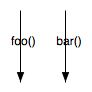
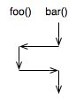
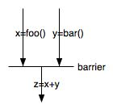

Java Thread Basics
====

# Overview

From: [Concurrency vs parallel execution](http://programmers.stackexchange.com/questions/190719/the-difference-between-concurrent-and-parallel-execution):

<blockquote><b>Concurrency</b> means that two or more calculations happen within the same time frame, and there is usually some sort of dependency between them. (Terence: GUIs have multiple things going on at the same time and are therefore concurrent but there might only be one processor so no parallelism.)

<p><b>Parallelism</b> means that two or more calculations happen simultaneously.

<p>Put boldly, concurrency describes a problem (two things need to happen together), while parallelism describes a solution (two processor cores are used to execute two things simultaneously).

<p>Parallelism is one way to implement concurrency, but it's not the only one. Another popular solution is interleaved processing (a.k.a. coroutines): split both tasks up into atomic steps, and switch back and forth between the two. (Terence: obviously timesharing on a single CPU is concurrent but not parallel)
</blockquote>


A thread is *not* an object, it's a series of executed instructions zipping thru method calls.  Imagine multiple CPUs and each one running code in your program (same data space) at the same time like ants crawling all over a code printout.  Java and the operating system take care of making one or a few CPUs handle many threads.  Here is the way I think of two threads executing methods `foo()` and `bar()` concurrently:



but in reality on single CPU with a single core they are interleaved:



Threads are useful because:

* support concurrent operation.  HTTP server.  crontab system (restarts managers, does stats, etc...).
* better system response. Add forum message; must add to search engine, email monitors.
* exploit parallelism. dual server: supports simultaneous execution
* Threads often permit simple programs.  Sequential loop doing bits of this and that, but that is a scheduler.  Don't have to check all the time for user events.

# Launching threads

1. Create class implementing `Runnable`.
1. Define `public void run()` method.  Thread dies when it exits.
1. Elsewhere, create instance of class, `r`.
1. Create `new Thread(r)`, `t`, attached to `r`.
1. `t.start()`.

Do Jabber (like log server).  Show lines of execution with interleaving.

```java
class Jabber implements Runnable {
  String str;
  public Jabber(String s) { str = s; }
  public void run() { // thread dies when finished
    while (true) {
      System.out.print(str);
      System.out.println();
    }
  }
}
```

Can use via:

```
class JabberTest {

  public static void main(String[] args) {
    Jabber j = new Jabber("University of San Francisco");
    Jabber k = new Jabber("Computer Science 601");
    Thread t = new Thread(j);
    Thread u = new Thread(k);
    t.start();
    u.start();
  }
}
```

Should intermix and not sync per line.

# Thread control

* `join()` wait for thread to finish
```
Computation c = new Computation(34);
Thread t = new Thread(c);
t.start();
t.join();
System.out.println("done");
```
* `sleep(int n)` sleep for n ms (keep locks) 
* `interrupt()` send signal to interrupt a sleeping or waiting thread
* `yield` suggest another can run

Here is a modified `Jabber` that forces a yield every 5 prints:

```
public class Jabber implements Runnable {
    String str;
    int i = 0;
    public Jabber(String s) { str = s; }
    public void run() {
        while (true) {
            i++;
            if ( i%5==0 ) {
                Thread.yield();
            }
            System.out.print(str);
            System.out.println();
        }
    }
}
```

Auto yields when blocked on IO.

Here is the thread lifecycle:


# Job pools

Works but no job control because `join()` only works on one thread:

```java
Thread t = new Thread(new Producer());
t.setName("Producer");
t.start();
t = new Thread(new Consumer());
t.setName("Consumer");
t.start();
```

Can't wait until we're done. Need `ExecutorService`:

```java
class Consumer implements Callable<Void> {
	public Void call()  { return null; }
}
...
ExecutorService pool = Executors.newFixedThreadPool(2);
List<Callable<Void>> jobs = new ArrayList<Callable<Void>>();

Consumer c = new Consumer();
Producer p = new Producer(c);
jobs.add(p);
jobs.add(c);

pool.invokeAll(jobs);
pool.shutdown();
pool.awaitTermination(2, TimeUnit.SECONDS);
```

# Thread safety issues

*Given shared state among multiple threads, they are safe as long as only read operations are performed on that state. If even one of them must write to it, they must coordinate read/write operations to be safe.*

We use `synchronized`, but also the `volatile` keyword as well as elements from `java.util.concurrent`.

A *race condition* occurs when the result depends on the order in which operations between threads are executed. This is not necessarily bad as in games that interact with the user but it generally is bad.

## Shared resource example

"critical section": Trains on same track (semaphore term comes from this).

Most common: The following terms all mean the same thing compare-and-set, test-and-set, check-then-act, read-modify-write. You check on some condition and then act on it but by the time you act, the condition might be changed. This can happen if you look both ways before crossing the street and then blindly walk; by the time you get into the road a car might be coming around the corner.  You might check to see if a file exists and then tried to delete it but another thread might get deleted before you perform the deletion.

## Lazy initialization example

```java
// @author Brian Goetz and Tim Peierls
public class LazyInitRace { // UNSAFE!!!!
    private ExpensiveObject instance = null;

    public ExpensiveObject getInstance() {
        if (instance == null) { // two threads might reach this conclusion simultaneously
            instance = new ExpensiveObject();
		}
        return instance;
    }
}
```

We can solve by supervising this method or by synchronizing just the comparison block as we will see below with "Double checked locking".

## Improper banking example

Bank has &#36;100 in account.  Boss goes to other teller, you go to me as teller.  Both want to add 5&#36;.  Race condition.  No matter what, it's wrong value.  "test and set" operations must be synchronized.  Then note that if you record changes not new value: &#36;100, +5&#36;, +5&#36; then it's ok.  No test and set.  So, sync reqts depend on what you are doing.  Looks like

```java
class Account {
    double balance = 0.0;
    public void deposit(float value) { // UNSAFE!!!
        balance = balance + value;
    }
}
```

We can solve this with a sickness method and making balance private.

## Compound operations
Compound operations are not thread-safe even when using thread-safe data structures. Protect code sequences that perform multiple operations that cannot be interrupted.

```java
class Amazon {
	private List<Book> inventory =
		Collections.synchronizedList(new ArrayList<Book>());
	private List<Sale> sales =
		Collections.synchronizedList(new ArrayList<Sale>());
	...
	public synchronized void checkout(Book b) {
		inventory.remove(b);        // op A
		sales.add(new Sale(b));     // op B
	}
	public synchronized Book audit() {
	    // check that all books are accounted for
		// This would give false "missing book" if we interrupt
		// checkout() between A and B.
	}
}
```
Note that while A and B operations are themselves atomic, we must declare the entire checkout procedure as a critical section via `synchronized` that must not be interrupted.

See also client-side locking below.

## List addition hazard

 Using an unsynchronized list with threads can cause lots of problems. First, we might interrupt a critical operation within the list such as `add()`. Also, we have to make sure that we guard our own test and set operations:

```java
import java.util.ArrayList;
import java.util.LinkedList;
import java.util.List;

public class Hazard {
	static class Producer implements Runnable {
		String str;
		public Producer(String s) { str = s; }
		public void run() {
			int i = 0;
			while ( i<5 ) {
				if ( !data.contains(str) ) {
					Thread.yield();
					data.add(str);
				}
				i++;
			}
		}
	}

	static class Consumer implements Runnable {
		public void run() {
			int i = 0;
			while ( i<5 ) {
				System.out.println(data);
				i++;
			}
		}
	}

	public static List<String> data = new ArrayList<String>();

	public static void main(String[] args) {
		Producer p = new Producer("X");
		Producer p2 = new Producer("X");
		Consumer c = new Consumer();
		new Thread(p).start();
		new Thread(p2).start();
		Thread u = new Thread(c);
		u.start();
	}
}
```

```bash
$ java Hazard
[X]
[X]
[X]
[X]
[X]
$ java Hazard
[null, X]       <-- we must have interrupted add() here
[null, X]
[null, X]
[null, X]
[null, X]
$ java Hazard
[null, X]
[null, X]
[null, X]
[null, X]
[null, X]
$ java Hazard
[X, X]
[X, X]
[X, X]
[X, X]
[X, X]
$ java Hazard
[X]
[X]
[X]
[X]
[X]
```

# Java thread-safe data structures

`java.util` classes list `ArrayList` and `HashMap` are not thread safe. Old classes like `Vector` and `Hashtable` are but slower.

Use `Collections.synchronizedXXX()` factories to make `ArrayList` and `HashMap` and friends thread-safe.

# Monitors

Java's thread model based upon monitors: chunks of data accessed only thru set of mutually exclusive accessor routines.  We can model this an object:

```java
class Data {
      // ... elements ...
      public synchronized void insert(Object o) {...}
      public synchronized void delete(String key) {...}
      public synchronized void read(String key) {...}
}
```

A `synchronized` method acquires a lock on the object (not the class). Every instance possesses a lock; atomic elements like integers can only be locked by locking some object, perhaps an enclosing one.

*Locking on an array object does not prevent multiple methods from accessing
 the elements of the array.*

Protects methods execution not data.

What happens when another thread interrupts and calls `deposit()`?  Solution:

```java
class Account {
  private double balance = 0.0;
  public synchronized void deposit(float value) {
    // lock on 'this' object acquired
    balance = balance + value;
	// lock released
  }
}
```

Like a "force field" around object.

* Lock is released upon exit from a synchronized method, even upon exception.
* If multiple threads try to access the same method on the same object, one succeeds and the others wait to acquire the lock.
* Non-synchronized methods do not respect the lock and can execute despite another thread having locked the object.

*Note*: Can lock statements too with `synchronized (object) statement`.

Same as

```java
public void deposit() { synchronized(this) { ... } }
```
*Note*: Class methods can be synchronized also:

```
class HPLaser {
  private static Device dev = ...;
  public static synchronized void print(String s) {...}
}
```

*Note*: Assignments are atomic minus `long` and `double`.

*Note*: local variables cannot be shared between threads so can't interfere.

Java uses the synchronized keyword not only for thread safety but also for synchronizing the execution of statements across threads and also for passing information between threads.

# Conditional synchronization

We want this:

```java
await (condition) do statement;
```

But we have `wait()` and `notifyAll()`. To call these functions you have to have a lock on the object because they inherently are waiting on state changes.

* `X.wait()`: releases the lock and suspends. Other threads can acquire the lock on `X`. Upon awakening, it requires the lock. The idea is to go to sleep until some event has occurred like data is available or I have completed the task.
* `X.notify()`: awaken a thread waiting on `X`'s lock.
* `X.notifyAll()`: awaken all threads waiting on `X`'s lock.

Note: `Thread.sleep(n)` does not release the lock as it does not have to be executed within a synchronized block. The sleep method is not a valid inter-thread communication; it just causes the current process for a while without consuming CPU time.

There might be lots of threads waiting on `X` for lots of different conditions. We cannot assume that we have been awakened for the proper condition and so it must be checked again. If we fail to find the event we wanted, we have to go back to sleep.  Goetz's concurrency book describes an example where lots of the being is going off in the kitchen; could be the microwave, the refrigerator door open, a cell phone, the oven, etc... Everyone wakes up to figure out if it's the condition they care about.

Instead of using `wait` and `notify`, we could use *busy waits* but those are typically very inefficient (not always...they are great if you need very low latency responses). See [SleepyBoundedBuffer.java](http://jcip.net.s3-website-us-east-1.amazonaws.com/listings/SleepyBoundedBuffer.java):

```java
    public void put(V v) throws InterruptedException {
        while (true) {
            synchronized (this) {
                if (!isFull()) {
                    doPut(v);
                    return;
                }
            }
            Thread.sleep(SLEEP_GRANULARITY);
        }
    }
```

## Explicit locks

Java >= 1.5 also provides a [`Lock`](http://docs.oracle.com/javase/7/docs/api/java/util/concurrent/locks/Lock.html) object.  In many ways it's very similar to `synchronized(object)` but we have control over when the object is unlocked and we can also ask it if it is locked. There is also no way to cancel an intrinsic lock.

<blockquote>
Lock implementations provide additional functionality over the use of synchronized methods and statements by providing a non-blocking attempt to acquire a lock (tryLock()), an attempt to acquire the lock that can be interrupted (lockInterruptibly(), and an attempt to acquire the lock that can timeout (tryLock(long, TimeUnit)).
</blockquote>

Here's a simple example use that properly increments a count variable. Without the locking, incorrect results occur reliably.

```java
import java.util.concurrent.BrokenBarrierException;
import java.util.concurrent.CyclicBarrier;
import java.util.concurrent.locks.Lock;
import java.util.concurrent.locks.ReentrantLock;

public class DemoLock {
	public static final int N = 10000;
	private static int count = 0;
	private static Lock lock = new ReentrantLock();
	private static CyclicBarrier barrier = new CyclicBarrier(3);

	static class Operation implements Runnable {
		public void run() {
			for (int i=1; i<=N; i++) {
				increment();
//				unsafeIncrement();
			}
			try {barrier.await();}
			catch (Exception e) {e.printStackTrace();}
		}

		void increment() {
			lock.lock();
			try {
				count = count + 1;
			}
			finally {
				lock.unlock();
			}
		}

		/** results in output like "Count 11148 should be 20000" */
		void unsafeIncrement() {
			count = count + 1;
		}
	}

	public static void main(String[] args) throws BrokenBarrierException, InterruptedException {
		Operation op = new Operation();
		Thread t = new Thread(op);
		t.start();

		Operation op2 = new Operation();
		Thread t2 = new Thread(op2);
		t2.start();

		barrier.await();
		System.out.printf("Count %d should be %d\n", count, N*2);
	}
}
```

BEWARE (API doc):
<blockquote>
Acquiring the monitor lock of a Lock instance has no specified relationship with invoking any of the lock() methods of that instance. It is recommended that to avoid confusion you never use Lock instances in this way, except within their own implementation.
</blockquote>

From Java 1.6 forward, the cost of doing intrinsic locking versus these explicit locks is basically the same. For simplicity I generally use the intrinsic locking. On the other hand, there are situations where we need to pull the lock or generally need more flexability. In that case, I use `Lock` explicitly.

See the lock-ordering deadlock section below for more use of `Lock`.

## Barrier wait

`t.join()` allows us to wait until `t` has finished, but what about having _n_ threads wait at a _barrier_ like this?  Let's implement our own barrier so that we can see how Java's library must do it.



For example, you might want to queue n people for each bus.

Want to code like this:

```java
class ParallelComputation implements Runnable {
	Barrier barrier;

	ParallelComputation(Barrier barrier) {
		this.barrier = barrier;
	}

	public void run() {
        // DO SOME COMPUTATION
		// now wait for others to finish
        try {
			barrier.wakeup();
            barrier.waitForRelease();
			System.out.println("thread released when count="+barrier.count);
		}
        catch(InterruptedException e) { e.printStackTrace(); }
    }
}
```

test code:

```java
public class DemoBarrier {
	public static final int N = 100;
	public static void main(String[] args) {
		Barrier barrier = new Barrier(N);
		for (int i=1; i<=N; i++) {
			new Thread(new ParallelComputation(barrier)).start();
		}
	}
}
```

and this implementation

```java
/**A very simple barrier wait.  Once a thread has requested a
 * wait on the barrier with waitForRelease, it cannot fool the
 * barrier into releasing by "hitting" the barrier multiple times--
 * the thread is blocked on the wait().
 */
public class Barrier {
	protected int threshold;
	protected int count = 0;

	public Barrier(int t) {
		threshold = t;
	}

	public void reset() {
		count = 0;
	}

	public synchronized void wakeup() {
		notifyAll();
	}

	public synchronized void waitForRelease()
		throws InterruptedException
	{
		count++;
		// The final thread to reach barrier resets barrier and
		// releases all threads
		if ( count==threshold ) {
			// notify blocked threads that threshold has been reached
			action(); // perform the requested operation
			notifyAll();
		}
		else while ( count<threshold ) {
//			System.out.println("thread waits");
			wait();
		}
	}

	/** What to do when the barrier is reached */
	public void action() {
		System.out.println("done "+count);
	}
}
```

Here's a real example using job is built-in `CyclicBarrier`:

```java
import java.util.concurrent.CyclicBarrier;

/** Map-Reduce addition example
 *
 *  Take data array of size N and split into SPLITS chunks.
 *  Launch a thread running an Adder on each chunk.
 *  The Adders right to partialResults array. There is no safety issue
 *  because they write to different positions in the array.
 *  Wait for all of them to reach the barrier.
 *  Reduce the results to a single some and print it out.
 */
public class DemoCyclicBarrier {
	public static final int N = 1000;
	public static final int SPLITS = 10;
	public static final int SPLIT_SIZE = N/SPLITS;
	static int[] data = new int[N];
	static int[] partialResults = new int[SPLITS];

	// +1 for main thread
	static final CyclicBarrier barrier = new CyclicBarrier(SPLITS+1);

	static class Adder implements Runnable {
		int split;
		public Adder(int split) {	this.split = split;	}
		public void run() {
			int start = split * SPLIT_SIZE;
			for (int i=0; i<SPLIT_SIZE; i++) {
				partialResults[split] += data[start+i];
			}
			System.out.println(Thread.currentThread().getName()+" done");
			try { barrier.await(); }
			catch (Exception e) { System.out.println("eh?"); }
		}
	}

	public static void main(String[] args) throws Exception {
		// init; make some data
		for (int i=0; i<N; i++) data[i] = i+1; // 1, 2, 3, 4, ..., N

		final Thread[] threads = new Thread[SPLITS];

		// create a thread on each split
		for (int i=0; i<SPLITS; i++) {
			threads[i] = new Thread(new Adder(i));
		}

		// MAP
		for (int i=0; i<SPLITS; i++) threads[i].start();

		barrier.await(); // wait for all threads

		// REDUCE
		int sum = 0;
		for (int i=0; i<SPLITS; i++) {
			sum += partialResults[i];
		}

		// should be (1 + N)*(N/2) = 500500
		System.out.println("Sum is "+sum);
	}
}
```

Java API for `CyclicBarrier`:

<blockquote>
A synchronization aid that allows a set of threads to all wait for
 * each other to reach a common barrier point.  CyclicBarriers are
 * useful in programs involving a fixed sized party of threads that
 * must occasionally wait for each other. The barrier is called
 * <em>cyclic</em> because it can be re-used after the waiting threads
 * are released.
</blockquote>

## One writer, multiple reader locks

The intrinsic locking and the `ReentrantLock` provide absolute exclusivity to a single thread, which is easy to think about but it's pretty conservative for some operations. For example, consider a list object that we primarily read from and only occasionally write to. It's overly expensive to prevent multiple readers on the off chance that a write comes in. [`ReadWriteLock`](http://docs.oracle.com/javase/7/docs/api/java/util/concurrent/locks/ReadWriteLock.html) is another kind of lock that allows multiple readers but a single writer.

API: "*A ReadWriteLock maintains a pair of associated locks, one for read-only operations and one for writing. The read lock may be held simultaneously by multiple reader threads, so long as there are no writers. The write lock is exclusive.*"

This object only gives you the ability to implement a data structure that handles multiple readers and a single writer but it doesn't guarantee you have such a data structure. Ultimately it's just a pair locks that are managed properly for multiple readers and a single writer. You still have to guard all reads and writes within your data structure appropriately. See Goetz's [ReadWriteMap](http://jcip.net.s3-website-us-east-1.amazonaws.com/listings/ReadWriteMap.java):

```java
public class ReadWriteMap <K,V> {
    private final Map<K, V> map;
    private final ReadWriteLock lock = new ReentrantReadWriteLock();
    private final Lock r = lock.readLock();
    private final Lock w = lock.writeLock();
	
	public V put(K key, V value) {
		w.lock();
		try { return map.put(key, value); }
		finally { w.unlock(); }
	}

	public V remove(Object key) {
		w.lock();
		try { return map.remove(key); }
		finally { w.unlock(); }
	}
	...
}
```

# Inter-thread communication

## Producer "/" consumer model

Example: blocking on I/O or network traffic.

Example: Message passing between actors.

### Blocking-queue "old school" <= Java 1.5

Here is a blocking queue template with unbounded buffer size:

```java
/** Augment a Queue to make threads block until remove() has data. */
class MyBlockingQueue {
   int n = 0;
   Queue data = ...;
   public synchronized Object remove() {
      while (n==0) wait(); // wait until there is something to read
      // we have the lock and state we're seeking
      n--;
      // return data element from queue
    }
    public synchronized void write(Object o) {
      n++;
      ... add data to queue ...
      // Since have data, tell any waiting threads to wake up
      notifyAll();
    }
}
```

Why is remove synchronized?  It's destructive; must be critical section.

Why write synchronized?  Critical section.

Here is an implementation of a 1-element queue:

```java
/** Simple queue that holds single value */
class SingleElementBlockingQueue {
    private volatile int n = 0;
    private volatile Object data = null;
    public synchronized Object remove() {
        // wait until there is something to read
        try {
            while (n==0) wait();
        }
        catch (InterruptedException ie) {
            System.err.println("heh, who woke me up too soon?");
        }
        // we have the lock and state we're seeking; remove, return element
        Object o = this.data;
        this.data = null; // kill the old data
        n--;
		notifyAll();
		return o;
    }

    public synchronized void write(Object o) {
		// wait until there is room to write
		try {
			while ( n==1 ) wait();
		}
		catch (InterruptedException ie) {
			throw new RuntimeException("woke up", ie);
		}
        n++;
        // add data to queue
        data = o;
        // have data.  tell any waiting threads to wake up
        notifyAll();
    }
}
```

Here is a `main()` that tests the queue:

```java
public class DemoSingleElementBlockingQueue {
	static SingleElementBlockingQueue q;

	static class Producer implements Runnable {
		public void run() {
			q.write("hello");
			q.write("again");
		}
	}

	static class Consumer implements Runnable {
		public void run() {
			System.out.println("data is "+q.remove());
			System.out.println("data is "+q.remove());
		}
	}

	public static void main(String[] args) throws Exception {
		q = new SingleElementBlockingQueue();
		new Thread(new Consumer()).start();
		Thread.sleep(1000);
		new Thread(new Producer()).start();
	}
}
```

Note that I try to consume first.  It will wait for 2 seconds (2000 ms) before the producer starts up and adds the element.

### Blocking queue >= 1.6 Java

The producer consumer mechanism is significantly easier these days. Here is the implementation from [`ArrayBlockingQueue`](http://docs.oracle.com/javase/7/docs/api/java/util/concurrent/ArrayBlockingQueue.html).

```java
final ReentrantLock lock;         // Main lock guarding all access
private final Condition notEmpty; // Condition for waiting takes
private final Condition notFull;  // Condition for waiting puts
```

```java
public E take() throws InterruptedException {
	final ReentrantLock lock = this.lock;
	lock.lockInterruptibly();
	try {
		while (count == 0) notEmpty.await();
		return extract(); // calls notFull.signal();
	}
	finally { lock.unlock(); }
}
```

```java
public void put(E e) throws InterruptedException {
	checkNotNull(e);
	final ReentrantLock lock = this.lock;
	lock.lockInterruptibly();
	try {
		while (count == items.length) notFull.await();
		insert(e); // calls notEmpty.signal();
	}
	finally { lock.unlock(); }
}
```

We have much finer granularity here then with the intrinsic wait and notifyAll(). First, we can awaken just a single thread because we know which queue of threads we are potentially waking up rather than all possible conditions. That is more efficient. Is also easier to understand with two different `Condition` objects. The other choices to have a single intrinsic queue of waiting threads with potentially multiple conditions they are actually waiting on.

# Some recommendations, patterns

You should read [Java concurrency in practice](http://jcip.net.s3-website-us-east-1.amazonaws.com/).

* Try to avoid threads.
* Have a single thread that is the only one to access critical data structures. This would be like the GUI event queue. (See more in next item.)
* Serialize access using a single thread. GUI event threads are the most obvious example. Java's Swing library has the [Event Dispatch Thread](http://docs.oracle.com/javase/tutorial/uiswing/concurrency/dispatch.html) do all of the manipulations on graphics objects. Multiple threads right to an event queue and there is a single thread that pulls work off of that queue. Very convenient in terms of thread safety but makes it slightly inconvenient when you need to react to events. If the event handler is a very expensive, the event thread must launch another thread to process it otherwise the entire GUI will freeze while the event is processed.
* Try to avoid **shared state** between threads
* If that is not possible, use **immutable objects** if you can:
```java
public class Point {
    final int x,y;
	public Point(int x, int y) { ... }
}
```
* For mutable objects, make sure that **fields are not directly accessible** and all methods that **get and set data are synchronized**.
```java
// partially from Brian Goetz and Tim Peierls
public class Point {
    private final int x,y; // private!
	public Point(int x, int y) { ... }
    public synchronized int[] get() { return new int[]{x, y}; }
    public synchronized void set(int x, int y) { ... }
}
```
* Protect **test-and-set** operations like `account += value` and *if there is data, give me the next element*. `count++` is also not thread safe.
* Remember to **synchronize all read sites** not just write sites to the same state and using the same lock!
* Be careful you **do not publish data** that is not adequately protected by returning a data structure.
```java
class T {
	static double secret = 99.0; // multiple threads can see this
	private SomeMutable[] internal = ... ;
	// synchronize does nothing here as we publish all data
	public synchronized SomeMutable[] getValues() { return internal; }
	// synchronize does nothing here as we publish mutable object
	public synchronized SomeMutable getValue(int i) { return internal[i]; }
}
```
* **Lock as little as possible** and for a short of time as possible but no less. This is for liveness, simplicity, and speed.
* Either to overcome unsafe classes or to guard sequences of operations with safe classes that must be done together or not done at all, use **client-side locking**:
```java
// @author Brian Goetz and Tim Peierls
public class SafeVectorHelpers {
    public static Object getLast(Vector list) {
        synchronized (list) {                // client-side lock
            int lastIndex = list.size() - 1; // test
            return list.get(lastIndex);      // set
        }
    }
    public static void deleteLast(Vector list) {
        synchronized (list) {
            int lastIndex = list.size() - 1; // test
            list.remove(lastIndex);          // set
        }
    }
}
```
A thread could interrupt in between the `list.size()` and the `list.get()`.


# Making shared data visible across threads

*At this point, everything just kind of works, but there is a hidden gotcha that we must ensure that data written in one thread is visible to another thread*.

Synchronization is not just about synchronizing threads. It's also about making sure that threads can see data written by other threads. As Goetz et al pointed out in the Java concurrency book, it seems natural that thread X writing to field `salary` that thread Y would see the changed value if it occurs after the write operation. Without synchronization and/or `volatile`, this is not the case.  From Jeremy Manson, assume the following `ready` variable is `volatile`:


Because ready is volatile, the second thread is guaranteed to print 42. When thread 1 writes to ready and then the second thread reads ready, all data previously written by thread 1 becomes visible to thread 2. Without the volatile, it might be the case that just one of those variables could leak through. For example, if ready leaks through but answer does not, the second thread will print 0!

To make threads operate efficiently on multi-core machines and to allow compiler optimizations that reorder operations, the Java memory model has to allow thread to pretend to execute in its own sandbox (which allows the CPU running the thread to access data from its local cache and not have to go all went back to main memory). [JDK5 and later extends the semantics for volatile so that the system will not allow a write of a volatile to be reordered with respect to any previous read or write, and a read of a volatile cannot be reordered with respect to any following read or write. ](http://www.cs.umd.edu/~pugh/java/memoryModel/DoubleCheckedLocking.html)

Jeremy Manson's [What Volatile Means in Java](http://jeremymanson.blogspot.com/2008/11/what-volatile-means-in-java.html)

Synchronization is also a means to ensure data written in one thread is available to another thread. An unlock on O in thread X followed by a lock of O in Y, guarantees that all data written prior to the unlock by X is visible to thread Y.

Manson: "*The reason that doesn't work for (non-volatile) double-checked locking is that only the writing thread ever performs the locking.*"

Before learning all of these details, I never had a problem with data not being communicated across threads. It could be that I just got lucky but I suspect it's because I had all of my shared state synchronized properly and synchronization makes data visible (and prevents compiler optimizations that would cause problems).

Volatile variables are slower because they cannot be cached and it prevents compiler optimizations that perform reordering. On the other hand volatile variables cannot cause deadlock because of locking as they are not locks

Goetz example demonstrating that volatile variables are good for status flags that indicate when to exit loops:

```java
volatile boolean asleep;           // set by thread X
...
   while ( !asleep ) countSheep(); // read by thread Y
```

## Double checked locking

[Double-Checked Locking is Broken](http://www.cs.umd.edu/~pugh/java/memoryModel/DoubleCheckedLocking.html)

The following is a correct but less than optimally efficient mechanism to get a singleton `Helper` object:

```java
// Correct multithreaded version
class Foo {
  private Helper helper = null;

  public synchronized Helper getHelper() {
    if (helper == null) {
        helper = new Helper();
	}
    return helper;
  }
  // other functions and members...
}
```

There will be locking for every reference to `getHelper()` even though we no longer need to lock because the object has been created.

We can try to make it more efficient by doing this

```java
// Broken -- Do Not Use!
class Foo {
  private Helper helper = null;
  public Helper getHelper() {
    if (helper == null) {
      synchronized(this) {
        if (helper == null) {
          helper = new Helper();
        }
      }
    }
  return helper;
}
```

```java
// This one works since volatile got fixed in java 1.5 or 1.6 I think
class Foo {
	private volatile Helper helper = null; // MUST be volatile
	public Helper getHelper() {
		if (helper == null) {
			synchronized(this) {
				if (helper == null) {
					// Helper init could happen out of order, i.e., after
					// helper field has been written.
					helper = new Helper();
				}
			}
		}
		return helper;
	}
}
```

Notice that if were using static singletons, [Java semantics guarantee that we won't see anything strange happened](http://www.cs.umd.edu/~pugh/java/memoryModel/DoubleCheckedLocking.html):

```java
class HelperSingleton {
  static Helper singleton = new Helper();
}
```

No matter how many threads reference a class, Java guarantees that a single thread wins the race to load the class, which does the initialization as well.


# Starvation

A thread with higher priority preempts your thread, never allowing it any CPU time. In Java, the thread with the highest priority is running, implying that any thread at a lower priority is starved unless the higher priority thread blocks or waits.

# Deadlock

Unsatisfied wait condition.  I ask for a piece of data that never becomes available.

Or, I'm waiting on you and you're waiting on me.  Jim was waiting on me to tell him when I finished something and I was waiting on him. This is the *deadly embrace*.

Famous *dining philosophers*: think and eat.  2 students with forks.  Must have two to eat but only one in front of you.  Everybody grabs to the right and then waits for stick on left.  Deadlock.  If not available, wait until it is then eat.  One possible solution is to have one philospher as a nonconformist: grabs left first.  If they are greedy they starve.  Could also have the grabbing of two sticks be synchronized so at least the first n-1 guys guy will finish.

## Lock-ordering deadlock

Explicit locks also allow us to poll locks to avoid potential deadlock situations. See Goetz's [DynamicOrderDeadlock](http://jcip.net.s3-website-us-east-1.amazonaws.com/listings/DynamicOrderDeadlock.java). Here is a snippet that shows an attempt to get two locks:

```java
synchronized (fromAccount) {
    synchronized (toAccount) {
        if (fromAccount.getBalance().compareTo(amount) < 0)
            throw new InsufficientFundsException();
        else {
            fromAccount.debit(amount);
            toAccount.credit(amount);
        }   
    }   
}   
```

The problem of course is that another thread might have locked one of the other objects. Here's the scenario: X tries to move money from my account to your account at the same time thread Y tries to move money from your account to my account. If X gets a hold of my account and Y gets a hold of your account, we have a deadlock!

This situation differs from our `Amazon` example above with a compound operation because that example uses a single lock for two data structures whereas here we have two different locks, one for each data structure.

The solution is to hold the locks to see if we can get both of them and, if not, hang out for a bit and try again. This is basically what ethernet does to get on the bus. A timed `tryLock` can be used to fail if we can't gain access to the resources soon enough. See Goetz's [DeadlockAvoidance](http://jcip.net.s3-website-us-east-1.amazonaws.com/listings/DeadlockAvoidance.java).

```java
while (true) {
    if (fromAcct.lock.tryLock()) {
        try {
            if (toAcct.lock.tryLock()) {
                try {
                   ...
                }
                finally { toAcct.lock.unlock(); }
            }   
        } 
        finally { fromAcct.lock.unlock(); }
    }   
    NANOSECONDS.sleep(fixedDelay + rnd.nextLong() % randMod);
}   
```

# Nonblocking algorithms

The idea is to avoid locks for performance reasons but nonblocking algorithms are also immune to deadlock. While a thread is blocked the lock, it can't do anything else and another thread holding the lock could be delayed. Locks also could involve context switches, which are very expensive. Unfortunately nonblocking algorithms are vastly more complicated to think about and design (i.e., get right) than locking algorithms.  Nonblocking algorithms rely on hardware instructions such as compare-and-swap and compare-and-set rather than locking which require operating system intervention:

```java
boolean compareAndSet(x, expectedValue, newValue);
```

The goal is to atomically set the value of `x` to `newvalue` if `x` is currently `expectedValue`.

The machine instruction looks like:

```
CAS addr,old,new
```

which atomically updates data at  `addr` to the `new` value only if the value at that address matches the expected `old` value. Multiple competing threads that attempt CAS on `addr` have one winner which updates the value and the rest lose. The losers are notified that they didn't win and should try again. This really helps with liveness because we are not stuck like we would be with a lock.

Here's an example like our bank account that updates an integer without having to do a heavyweight lock:

```java
AtomicInteger n = new AtomicInteger(0);
...
v = ...;
while ( true ) {
	int current = n.get();
	int newValue = current + v;
	if ( n.compareAndSet(current, newValue) ) {
		break; // heh, we succeeded in setting the value safely!
	}
}
```

See [DemoConcurrentAtomInt](https://github.com/parrt/cs601/blob/master/lectures/code/threads/DemoConcurrentAtomInt.java).

This is the thread safe equivalent of:

```java
int n = 0;
...
v = ...;
n = n + v;
```

In many ways these are like transactions. We attempt to do something, and if it fails, we try again until we succeed, optionally pausing slightly before trying again. Naturally, these operate at a much finer granularity than either transactions or locks, which is the source of their performance advantage. The code for `getAndIncrement`, for example, is illuminating:

```java
/** Atomically increments by one the current value. */
public final int getAndIncrement() {
	for (;;) {
		int current = get();
		int next = current + 1;
		if (compareAndSet(current, next)) {}
			// only set to newValue if 
			return current;
		}
	}
}
```


Locks are *pessimistic* whereas fine-grained atomic operations are *optimistic*. They assume that contention likelihood is low, which is valid particularly given the small cost of these atomic operations.

## Nonblocking atomic elements

To build nonblocking algorithms in Java, we need the so-called *atomic variable classes* such as [`AtomicInteger`](http://docs.oracle.com/javase/7/docs/api/java/util/concurrent/atomic/AtomicInteger.html). See the general description at the [java.util.concurrentatomic package](http://docs.oracle.com/javase/7/docs/api/java/util/concurrent/atomic/package-summary.html).

```java
import java.util.concurrent.CyclicBarrier;
import java.util.concurrent.atomic.AtomicInteger;

public class DemoConcurrentAtomInt {
	final static int N = 10;
	static AtomicInteger n = new AtomicInteger(0);
	static final CyclicBarrier barrier = new CyclicBarrier(N+1);

	static class Depositor implements Runnable {
		int v;
		public Depositor(int v) {
			this.v = v;
		}
		public void run() {
			while ( true ) {
				int current = n.get();
				int newValue = current + v;
				if ( n.compareAndSet(current, newValue) ) {
					break;
				}
			}
			try {barrier.await();}
			catch (Exception e) { e.printStackTrace(); }
		}
	}

	public static void main(String[] args) {
		final Thread[] threads = new Thread[N];

		for (int i=0; i<N; i++) {
			threads[i] = new Thread(new Depositor((i+1)*10));
		}

		// 10+20+30+...10*10 = 550 if N=10
		for (int i=0; i<N; i++) {
			threads[i].start();
		}

		try {barrier.await();}
		catch (Exception e) { }

		System.out.println(n.get());
	}
}
```

These operations significantly outperform locking operations but are obviously more complicated to implement because of the boilerplate code. Java 8 lambda notation might make this easier. On a single processor, CAS might only take a few cycles but on a multiprocessor machine it could take 100 cycles.

In order to get atomic floating-point, you have to use unsigned integers and convert from floats to bits. ick.

`Volatile` variables and atomic variables are different. The volatile ones simply guarantee that the value can be properly shared across threads but they do not prevent race conditions during compare and set operations.  For example, incrementing a volatile from multiple threads can lose a few updates, but that's okay if you don't care. If you are creating a pseudo random sequence of numbers, you care about dropping values as it alters the sequence. In that case, you need to hold things in and atomic integer.

## Lock-less data structures

Java provides a number of lock was data structures that often perform well in the presence of multiple threads accessing them. E.g., [`ConcurrentHashMap`](http://docs.oracle.com/javase/7/docs/api/java/util/concurrent/ConcurrentHashMap.html). "*Retrieval operations (including get) generally do not block, so may overlap with update operations (including put and remove).*" Also see [`ConcurrentLinkedQueue`](http://docs.oracle.com/javase/7/docs/api/java/util/concurrent/ConcurrentLinkedQueue.html). Their designs and implementations were done by experts. Such algorithms use lots of tricks such as dividing up data structures into regions and having threads work on different regions. According to Goetz, "*The key to creating nonblocking algorithms is figuring out how to limit the scope of atomic changes to a single *variable* while maintaining data consistency*."