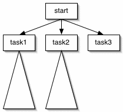

Top Down Design
====

# Method organization issues

1. If your code has a large average method size, you may not be breaking down your functionality into manageable pieces.

1. If your method names don't indicate a specific task and are things like {step2()} or {do_it()} you may not be properly breaking down your functionality into recognizable tasks or conceptual operations.

1. If your code has a very shallow functional decomposition tree, you may not have broken down your tasks into fine-grained chunks.

1. If none of your objects or methods appear to be "reusable", you may not be associating real world abstractions with programming units.

1. If you have lots of duplicated code.

# The Goals Of Software Engineering Methodologies

Your goal when designing software should be to think about as little as possible at one time.  An implementation derived from such a design will tend to be composed of small, manageable "chunks" that

* relate to problem concepts or tasks
* are easier to write
* easier to understand
* have fewer undesirable dependencies or side-effects on other areas of code

In general a design document is both a means by which programmers communicate with each other and a navigation document for programmers unfamiliar with the system (this includes you as even a few months can make your own code unfamiliar to you).

# How To Design a Program

## Divide and Conquer

All programmers and design "experts" agree that you should break down
your problem into small chunks--they disagree on how to slice it up.
Can slice the design multiple ways: by aspect (log manager), by actor
(person object), by functionality (EmailManager), and within a method
by functional decomposition.

You should _divide and conquer_ so that no single piece is too big.
When you set out to write a book, you start with an outline not a
specific paragraph or figure.  An outline amounts to a chapter list
which you then expand for each chapter.  You then expand each chapter
into a section list and so on.

*A key point*: as you break down the outline into finer-grained
chunks, you will need to alter the overall structure of the chapter or
even the whole book because you know more about the problem.  This is
called _refactoring_ in the programming world and we will discuss in a
future lecture.

The book outlining process is an apt analogy to the functional
decomposition design strategy of iterative refinement.  The overall
structure/outline/design is very nonspecific and references
ill-defined concepts that can only be concretely defined by further
refinement.

_Information hiding_ is an old old concept that got incorporated into
object-oriented design.  The idea is simply to reduce what you have to
think about at one time per design goal mentioned above.  In terms of
objects, it means that you do not expose your implementation, just
some well-behaved methods that provide a service to other objects.  In
terms of functional decomposition, it means that each method should be
just a few references to other methods, which in turn reference a few
methods until you get to an atomic operation.

Object-oriented programming languages call information hiding
_encapsulation_ and specifically provide language constructs to
support it (in C you had to group functions by file whereas OO
languages provide classes).  Use encapsulation to

1. group similar functionality into a single "module" (a class in
Java).  These are your _managers_ or _services_ such as EmailManager,
UserManager, ...
1. group data and behavior associated with a real world entity into an
object.  These are your "actors" and entities such as User,
EmailMessage, PopAccount, ...

## Break functions into smaller chunks

The hallmark of the beginning student is to have a few really long
methods instead of more but smaller methods.  Why is it bad to have
long methods?

1. hard to understand long sequences, especially if there are IF
conditionals
1. hard to reuse big chunks whereas each smaller chunk could be
reusable; factoring your code into smaller methods usually makes the
whole program shorter due to code reuse.

Why is good to factor big methods into smaller?

1. the top level function that calls the subfunctions is like an index
1. each subfunction has a nice name that clearly identifies its function

## Functional Decomposition Diagrams

A top-down design or _functional decomposition diagram_ resembles a method call dependency diagram where each method at level _n_ is the root of a sub-branch whose children are methods the root calls.  The diagram is not strictly a tree as recursion results in a cycle and a method may invoke other branches of the diagram.



The leaves of the tree are self-contained methods that do not need to invoke other methods (except perhaps {System.out.println()} and the like) such as task3.  In any given node, you should assume that all other methods work or will become available--focus solely on the sequence of steps taken by that method.

This diagram doesn't show implementation details; it just shows the breakdown of tasks into subtasks for a particular operation (the root).  Some subtasks are implemented later as inline code while other subtasks are implemented as references to other methods that you then must further break down into another branch.

If you want, you can label the information flow to and from the methods by their name.

Sometimes a branch maps to a module for which we use a class like a {DatabaseManager} singleton object.  Most often a decomposition diagram path will weave through several objects.

Another method is to imply a diagram by simply referencing another method that lives on another sheet of paper or wherever.

```
Start:
	task1
	task2
	task3

task1:
	blah blah

task2:
	blort blort
```

# The Design Process

1. Write down the functionality of your system so you have a clear
picture of what it does.  For example, you can draw out the site map
for a website and list all the pages, which will identify all the
top-level functional requirements.

1. Identify the _actors_ in your system (what are the major components
in your system?).  List the major message and data traffic
interaction, which usually highlights some new helper objects.

1. Group similar tasks or aspects of your program into a single
object; objects have to play the role of _modules_ or _services_ in
Java.

1. For each method of each object, apply top-down functional
decomposition.  Each method should have as few "operations" as
possible while still being a complete concept.  Further break down
each of these operations until you think you have an "atomic"
operation that is just a few simple programming instructions.

*Coding*: Implement the methods top-down.  Contrary to some advocates of
top-down design, I recommend strongly that you implement your methods
starting at the highest level and working downwards.  Changes at level
n force changes at level n+1 and below like a ripple effect.

*Testing*: Test your methods bottom-up by writing little test
harnesses; this is called _unit testing_.  At each level, you will
have confidence in the level(s) below you.

In summary, you will design your overall program using a object interaction diagram and design each object using functional decomposition.

# An HTTP Server Case Study

Let's design the HTTP server because it's familiar to you.

## Object Interaction Diagram

First, my basic understanding of the actors at work:

Server ->* ClientHandler

From this,  it looks like we need two classes:

1. {Server.java}
1. {ClientHandler.java}

But this does not tell me how they implement these inter-object messages.  For that, I will provide a top-down design for the major methods.

## Functional Decomposition

My text only functional decomposition (*across objects*) looks like:

```java
Server.main:
	check args (server root, log dir root, ...)
	create and launch Server.accept()

Server.accept:
	forever do {
		wait for a socket connection
		create a new ClientHandler attached to socket
		create a thread on the handler and launch
	}

ClientHandler.run: (invoked from thread.start())
	Get the first line of input
	If not empty, process
	shutdown input/output streams
	close socket

ClientHandler.process
	If input line does not start with GET, return
	parse HTTP GET command
	dumpFile

ClientHandler.dumpFile
	open file to dump
	read it all in and write to output stream to client
	flush output stream
	close file stream
```

Note that I don't worry about details like object constructors at this point.  That's an implementation detail.

I tend not to worry about arguments to methods until implementation.

I also don't worry much about error checking at this "algorithm" stage.

*You'll see something like this on the final!*


## Full HTTP Server Implementation

Here you will find a straightforward implementation of my object diagram and decomposition.

## Server (main)

```java
!INCLUDE "code/http/HttpServer.java"
```

## ClientHandler

```java
!INCLUDE "code/http/ClientHandler.java"
```

## Student Examples

### Good example

A student had the same breakdown (minus one intermediate method that I had, {process()}):

```java
public void run() {
	try {
		String line = in.readLine();

		if (line != null) {
			if (line.startsWith("GET")) {
				int n = line.indexOf(' ') + 1;
				int m = line.indexOf("GET");
				String filename = line.substring(n, line.indexOf(' ', n + 1));
				sendFile(filename);
			}
			channel.shutdownInput();
			channel.shutdownOutput();
			out.close();
			in.close();
			channel.close();
		}
		...
	}
}
```

Note the same reference to real world abstractions: {callClass} and {sendFile}.

### Less than optimal example

Here is another student example (names, style mangled to protect identity) where everything is in a big method with a name indicating they don't really have a clear relationship to real world concept or operation.  The operations are also inline.  Harder to write this way, harder to read, can't resuse anything.

```java
void doTheJob() {
	int i = 0, j = 0;
	String line;
	String str = new String();
	line = br.readLine();
	if (line.indexOf("GET") >= 0) {
		i = line.indexOf("/");
		j = line.substring(4).indexOf(" ");
		str = line.substring(i+1, j + 4);
		while((i = str.indexOf("%20"))>=0) {
			str = str.substring(0, i) + " " +
				  str.substring(i+3, str.length());
		}

		File fileName =
			new File(Server.document_root.getAbsoluteFile(),str);
		if (fileName.exists()) {
			byte[] buffer = new byte[Server.length];
			int len;
			BufferedInputStream fb =
				new BufferedInputStream(new FileInputStream(fileName));
			do {
				len = fb.read(buffer, 0, Server.length);
				bos.write(buffer, 0, Server.length);
			}
			while(len > 0);
			fb.close();
			bos.close();
			fileName = null;
		}
		else {
			// file not found
			...
		}
		...
	}
}
```

How about this one?

```java
public class ClientHandler implements Runnable{
	Socket socket;
	String docRoot;
	String fileLocation;
	OutputStream out = null;
	PrintStream p = null;
	InputStream in = null;
	BufferedReader buf;

	public ClientHandler(Socket socket, String docRoot) {
		this.socket = socket;
		this.docRoot = docRoot;
	}

	public void run() {
		try {
			// Get In and Out streams sorted
			out = socket.getOutputStream();
			p = new PrintStream(out);
			in = socket.getInputStream();
			//Using bufferedReader in instead because readline is not deprecated
			buf = new BufferedReader(new InputStreamReader(in));

			// Split the header string: requestPart[0] = GET, requestPart[1]= /filepath
			String headerLine = buf.readLine();
			String[] requestPart;
			requestPart = headerLine.split(" ");
			String get = requestPart[0];
			String filePath = requestPart[1];

			if (!get.startsWith("GET")) {
				p.print(ErrorManager("Server only accepts GET command."));
				closeAll();
			}
			else {
				fileLocation = docRoot + filePath;
				if (filePath.equals("/")) {
					filePath = indexFileHandler();
					fileLocation = docRoot + filePath;
				}
				downloadFile(fileLocation);
			}
		}
		catch (IOException e) {
			e.printStackTrace();
		}
	}
	private void downloadFile(String fileLocation) throws IOException {
		File f = new File(fileLocation);

		if (f.exists() || f.isDirectory()) {
			FileInputStream inFile = new FileInputStream(f);

			// Sort out header
			String httpHeader = "HTTP/1.0 200 OK\n";

			//Determine Content-Type
			String contentType;

			if ((fileLocation.endsWith(".html") == true) | (fileLocation.endsWith(".htm") == true)) {
				contentType = "Content-Type: text/html\n\n";
			}
			else if (fileLocation.endsWith(".gif") == true) {
				contentType = "Content-Type: image/gif\n\n";
			}
			else if (fileLocation.endsWith(".jpg") == true) {
				contentType = "Content-Type: image/jpg\n\n";
			}
			else {
				contentType = "Content-Type: \n\n";
			}
			// Write headers
			out.write(httpHeader.getBytes());
			out.write(contentType.getBytes());

			// Handle binary file
			byte[] buffer = new byte[1024];
			int readCount = 0;

			while ((readCount = inFile.read(buffer)) >0) {
				out.write(buffer, 0, readCount);
			}
		}
		else {
			p.print(ErrorManager("File doesn't exist."));
		}
		closeAll();
	}

	private String indexFileHandler() {
		File indexFile = new File(docRoot + "/index.htm");
		if (indexFile.exists() == true) {
			return "/index.htm";
		}
		else {
			return "/index.html";
		}
	}
	private void closeAll() throws IOException {
		out.close();
		p.close();
		in.close();
		buf.close();
		socket.close();
	}
	static public String ErrorManager(String contentIn){
		String htmlPage = "<html><head><title>Error!!!</title>" +
						  "<body text=#33FFFF bgcolor=#333333>"+
						  "<h1>Error!!!</h1>" +  "<p>" + contentIn + "</p>"+
						  "</body></html>";
		return htmlPage;
	}
	static public String htmlPage(String contentIn){
		String htmlPage = "<html><head><title>Display</title></head>" +
						  "<body text=#33FFFF bgcolor=#333333>" +
						  "<p>" + contentIn + "</p>" +
						  "</body></html>";
		return htmlPage;
	}
}
```
