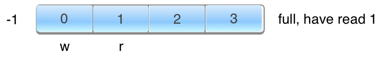

Blocking queues and message passing
=======

# Goal

Your goal in this project is to explore the use of blocking queues and message passing between producers and consumers or *actors*. You will build two blocking queues yourself, `SynchronizedBlockingQueue` and `RingBuffer`, then in another case you will use Java's `ArrayBlockingQueue`.

In order to test the efficiency of the blocking queues, you will also build a `ThreadObserver` that measures the ratio of time a thread spends block versus running.

# Discussion

This project requires a message queue between a producer and a consumer, which we can formalize as follows:
 
```java
public interface MessageQueue<T> {
	void put(T o) throws InterruptedException;
	T take() throws InterruptedException;
}
```

I have provided a test rig that creates a producer and consumer that communicate using the message queue and object sequence passed in. The number of messages is also required as an argument to the `test` function as is a signal object that indicates the message queue is over. Without such a sentinel, we need control methods, which are significantly more complicated.

```java
RingBuffer<Integer> queue = new RingBuffer<Integer>(1024);
Iterator<Integer> sequence = new IntegerSequence(1,N);
int EOF = -1;
TestRig.test(queue, sequence, N, EOF);
```

The test rig launches `ThreadObserver` objects to track how much of the time our producer and consumers are blocked using a simple *sampling* technique.

# Tasks

## Message producer

## Message consumer

## Message buffer using synchronization

## Message buffer using `ArrayBlockingQueue`

## Lockless message buffer

Using a [circular buffer](http://en.wikipedia.org/wiki/Circular_buffer), sometimes called a *ring buffer*, you must create a lock plus message buffer. We think of the buffer as circular because we start writing over elements at the beginning instead of falling off the end of the buffer. But, it's easier to think about linearly. Here's the initial state of the buffer for n=4.


Where `r` is where we are about to read and `w` is where we had just written. Therefore, a full buffer is when `w` it's the end of the buffer and cannot rap because we have not read yet:


After we have read the single element, `w` can wrap to 0:



Note that we are tracking absolute indexes, using `long`s, rather than keeping a pointer inside the array or an index in 0..n-1. This is convenient as it can tell us how many we have read and written but also is important for the lock plus nature of this data structure. `r` and `w` will constantly chase each other towards infinity as `AtomicLong`s.

```java
public class RingBuffer<T> implements MessageQueue<T> {
	private final AtomicLong w = new AtomicLong(-1);	// just wrote location
	private final AtomicLong r = new AtomicLong(0);	// about to read location
	...
}
```

Note: you should throw an `IllegalArgumentException` if the fixed buffer size is not power of 2.  If `n % k` is `n & (k-1)` if n power of 2, which is vastly more efficient than the mod operator. Here is a useful function for you:

```java
// http://graphics.stanford.edu/~seander/bithacks.html#CountBitsSetParallel
static boolean isPowerOfTwo(int v) {
	if (v<0) return false;
	v = v - ((v >> 1) & 0x55555555);                    // reuse input as temporary
	v = (v & 0x33333333) + ((v >> 2) & 0x33333333);     // temp
	int onbits = ((v + (v >> 4) & 0xF0F0F0F) * 0x1010101) >> 24; // count
	// if number of on bits is 1, it's power of two, except for sign bit
	return onbits==1;
}
```

This data structure is straightforward if we don't care about blocking or threads. The key comes down to two methods that I have in my implementation.

```java
// spin wait instead of lock for low latency store
void waitForFreeSlotAt(final long writeIndex) {
	// wait until we have at least one spot, meaning w < r
	// since circular buffer though we worry about wrapping. We
	// have to wait if we've got n values in the buffer already.
}
```

```java
// spin wait instead of lock for low latency pickup
void waitForDataAt(final long readIndex) {
	// wait until w catches up or passes desired read location
	// repeat until just-wrote-index >= about-to-read-index
}
```

## Thread observer

# Requirements

# Submission