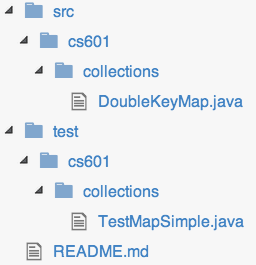

#  Double key hash table

## Discussion

This project tests your programming ability, your ability to code in Java, your knowledge of simple data structures, and how well you can read and follow instructions. This project is a typical undergraduate project, but with a shorter deadline. If this project is not easy for you, this course may overwhelm you. This project is a good way for us to get to know each other. :)

Your  task is to produce a simple Java implementation of a dictionary interface similar to Java's built-in ```Map<Key,Value>``` interface. The interface is called ```DoubleKeyMap<Key1,Key2,Value>``` ([download](resources/DoubleKeyMap.java)) and is in a package called ```cs601.collections```. Your implementation must be called ```DoubleKeyHashMap<Key1,Key2,Value>``` and must also be in package ```cs601.collections```.

You should test your your code well including all boundary conditions as you will not see the test harness source code I will use to check out your project.  You must implement this project successfully without knowing precisely how I will test it. There are many reasons:

* Part of writing software is thinking about and implementing tests for your own work.
* You must get used to the idea that you do not know how other programmers will use your objects. Programmers communicate by examining the collection of classes and the list of messages they answer.

This project is primarily meant to test your basic Java skills:

* basic class construction and usage
* statements and expressions
* object references
* simple data structure construction
* interfaces
* generics
* compilation and jar'ing

*IMPORTANT*: You are to actually implement a hashtable using an array of ```List<T>``` containing wrapper objects that wrap the 2 keys and the value using a technique called [separate chaining](http://en.wikipedia.org/wiki/Hash_table#Separate_chaining_with_linked_lists). *Do not simply wrap Java's existing ```Map``` interface.  You can use ArrayList and LinkedList if you want.* For example, your solution will need a helper class like ```Entry```:

```
package cs601.collections;

public class DoubleKeyHashMap<K1,K2,V>
    implements DoubleKeyMap<K1,K2,V>
{
    class Entry { K1 key1; K2 key2; V value; ... }
}
```

## Requirements

The exact external behavior of your classes should follow the javadoc comments in the interface definition. Your hash table should be a fixed size array of "buckets" that stores all key/value pairs with the same hash value. There is no need to enlarge the number of buckets for this project when the number of elements per bucket gets large. Order matters for the keys. key1,key2 is different than key2,key1. The order of ``put()`` does *not* matter. For your hash function, you can use:

```
Math.abs(key1.hashCode() * 37 + key2.hashCode())
```

Your implementation class must define a constructor with no arguments and one with an argument specifying the (``int``) number of buckets.

All of your classes must be in the ``cs601.collections`` package. When you clone your repo, it should look like to start:



You are creating a library, NOT a main program.

Do not generate any output from your library. Only test rigs should generate output. In other words, do not leave any debugging println statements around. Do not print error messages upon invalid keys and so on. Upon error, you will be throwing exceptions per the interface.

You should test your library extensively. I have provided an initial unit test for you in [TestMapSimple.java](resources/TestMapSimple.java).  You will need [``junit-4.10.jar``](http://sourceforge.net/projects/junit/files/junit/4.10/junit-4.10.jar/download).  Committing to your repository will trigger a test with a rigorous set of my own tests via the [continuous integration server](http://www.travis-ci.com).

## Submission

You will clone your student repository to your local disk and develop in that directory, committing files and changes as necessary. Your repository will be something like:

https://github.com/USF-CS601-S15/userid-doublekey

You can use ```git``` from the command-line, from within your IDE (such as [Intellij](http://www.jetbrains.com/idea/download/)), or using the free [SourceTree](http://www.sourcetreeapp.com/) app.  Here is a sample session from the command line:

```
$ cd ~/cs601/projects # or whatever
$ git clone git@github.com:USF-CS601-S15/userid-doublekey.git
Cloning into 'userid-doublekey'...
remote: Counting objects: 21, done.
remote: Compressing objects: 100% (9/9), done.
remote: Total 21 (delta 3), reused 17 (delta 2)
Receiving objects: 100% (21/21), done.
Resolving deltas: 100% (3/3), done.
Checking connectivity... done.
$ cd userid-doublekey
$ cd src/cs601/collections
... create DoubleKeyHashMap.java ...
$ cd ~/cs601/projects/test/cs601/collections
... add unit tests to TestMapSimple.java ...
$ git commit -a -m 'your comments'
[master 21c0593] your comments
 2 files changed, 27 insertions(+), 6 deletions(-)
 create mode 100644 projects/resources/TestMapSimple.java
 ...
$ git push origin master
Counting objects: 10, done.
Delta compression using up to 12 threads.
Compressing objects: 100% (6/6), done.
Writing objects: 100% (6/6), 1.08 KiB | 0 bytes/s, done.
Total 6 (delta 2), reused 0 (delta 0)
To git@github.com:parrt/cs601.git
   65ed6db..21c0593  master -> master
$
```

You can keep on changing and adding files as you wish. Just make sure to commit and push everything to github. The state of your repo at github will be what is graded at the due date/time.

Until you create ``DoubleKeyHashMap.java``, the continuous integration server will show you a compilation error:

```
...
/home/travis/build/USF-CS601-S15/parrt-doublekey/test/cs601/collections/TestMapSimple.java:11: error: cannot find symbol
			new DoubleKeyHashMap<String, Integer, Double>();
			    ^
  symbol:   class DoubleKeyHashMap
  location: class TestMapSimple
...
```

## Grading

A continuous integration build server will run your program by cloning your repo, building it, and running some unit tests.

Here's an example of how to use the new map interface:

```
import cs601.collections.*;
...
DoubleKeyMap<String,Integer,Double> m =
    new DoubleKeyHashMap<String, Integer, Double>();
m.put("hi",32,99.2);
double d = m.get("hi",32);
System.out.println(d); // should be 99.2
System.out.println(m.containsKey("hi",32)); // should be true
System.out.println(m.containsKey("hy",3));  // should be false
```

You may discuss this project in its generality with anybody you want and may look at any code on the internet except for a classmate's code. You should physically code this project completely yourself but can use all the help you find other than cutting-n-pasting or looking at code from a classmate, the web, or other Human being.

*I will deduct 10% if your program is not executable exactly in the fashion mentioned in the project*; that is, class name, methods, lack-of-package, and jar must be exactly right. For you PC folks, note that case is significant for class names and file names on UNIX! All projects must run properly under UNIX.  That means it's a good idea to test it there yourself.
