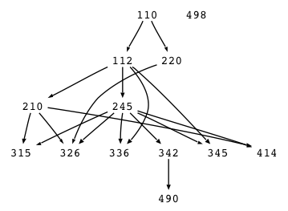

# Unweighted Graph

## Discussion

This project tests your programming ability, your ability to code in Java, your knowledge of simple data structures, and how well you can read and follow instructions. This project is a typical undergraduate project, but with a shorter deadline. If this project is not easy for you, this course may overwhelm you. This project is a good way for us to get to know each other. :)

Your  task is to produce a simple Java implementation of a graph with interfaces called `Graph` and `Node`. Your work will be in a package called ```cs601.graph```. Your implementation must be called `UnweightedGraph` and must also be in package ```cs601.graph```.  For example, your software will need to answer such questions as:

* Which courses are needed before you can take 490
* How fast in terms of number of semesters can you finish 490?
* How many courses depend directly or indirectly on 112?
* List all courses you can take after you finish 210
* List all courses without prerequisities; I.e., list courses that have no incident (incoming) edges?

Your program will accept as input a graph such as the following partial USF course dependency graph:



in the form of an edge list:

```
110 -> 112
112 -> 210
110 -> 220
112 -> 245
210 -> 315
245 -> 315
210 -> 326
220 -> 326
245 -> 326
112 -> 336
245 -> 336
245 -> 342
112 -> 345
245 -> 345
210 -> 414
245 -> 414
342 -> 490
498
```

I provide the parser for you. You just have to provide `Graph` and `Node` implementations.

You should test your your code well including all boundary conditions as you will not see the test harness source code I will use to check out your project.  You must implement this project successfully without knowing precisely how I will test it. There are many reasons:

* Part of writing software is thinking about and implementing tests for your own work.
* You must get used to the idea that you do not know how other programmers will use your objects. Programmers communicate by examining the collection of classes and the list of messages they answer.

This project is primarily meant to test your basic Java skills:

* basic class construction and usage
* statements and expressions
* object references
* simple data structure construction
* interfaces
* generics
* compilation and jar'ing

But, it will also test your ability to write recursive functions.

*IMPORTANT*: You are to actually implement a graph data structure. You must not simply wrap any existing Java library objects or libraries from another source.

```java
package cs601.graph;

public class UnweightedGraph<ID extends Comparable, N extends Node<ID>>
  implements Graph<ID,N>
{
    ...
}
```

## Graph operations

After the graph edge list, you can type in a series of commands:

* `print`
Prints edges for each node in the order that the nodes were encountered in the input. Print them one per line. For example, this input
```
110 -> 112
112 -> 210
110 -> 212
```
yields
```
110 -> 112
110 -> 212
112 -> 210
```

That is to normalize things so all of our output looks the same. The way to handle this is to create a `LinkedHashMap` that records the order in which you add things to the node map. When you want to print the graph back out, iterator over the values of that map and print all edges before moving on to the next node.
* `len start stop`
Prints the **minimum** number of edges traversed to go from start to stop. If stop == start, print 0.
* `nodes start stop` 
Prints all nodes along **all** paths from start to stop. The list of nodes must be sorted.
* `reach start` 
Prints the list of all nodes reachable from start.
* `roots` 
Print the graph roots. A graph root is any node has no incident (incoming) edges.

Here are some sample commands:

```
print
len 112 112
len 110 112
len 110 345
nodes 110 490
len 110 490
nodes 110 345
len 110 345
reach 110
reach 326
roots
```

and the associated output:

```
...edge list in order specified...
len 112 -> 112 = 0
len 110 -> 112 = 1
len 110 -> 345 = 2
nodes 110 -> 490 = [110, 112, 245, 342, 490]
len 110 -> 490 = 4
nodes 110 -> 345 = [110, 112, 245, 345]
len 110 -> 345 = 2
reach 110 = [110, 112, 210, 220, 245, 315, 326, 336, 342, 345, 414, 490]
reach 326 = [326]
roots = [110, 498]
```

My parser creates the appropriate output for you; you just have to fill in the algorithm methods.

## Implementation

You will implement `UnweightedGraph`, which is a set of `Node` objects. You must create an implementation of `Node` called `NamedNode`. A Graph is just a mapping from node name to `Node` object (use `LinkedHashMap`) and defines the methods implementing the required algorithms. A `Node` has an identifier and a list of edges. Note that the list of edges must be `List<ID>` rather than `List<Node>` because you can reference a node in the edge list before you have defined it. By using string node names in the edge list, you can always look up the nodes in the `Graph` mapping.


## Requirements

The exact external behavior of your classes should follow the javadoc comments in the interface definition. 

* You can use Java 8 or below.
*  You must maintain the order in which the edges are specified so use `LinkedHashMap`.
* All of your classes must be in the ``cs601.graph`` package. When you clone your repo, it should look like this to start:
* Do not generate any output from your library.  In other words, do not leave any debugging println statements around. Do not print error messages upon invalid nodes etc...
* You may discuss this project in its generality with anybody you want and may look at any code on the internet except for a classmate's code. You should physically code this project completely yourself but can use all the help you find other than cutting-n-pasting or looking at code from a classmate, the web, or other Human being.
* *I will deduct 10% if your program is not executable exactly in the fashion mentioned in the project*; that is, class name, methods, lack-of-package, and jar must be exactly right. For you PC folks, note that case is significant for class names and file names on UNIX! All projects must run properly under UNIX.  That means it's a good idea to test it there yourself.

## Starter kit

```
├── .travis.yml
├── LICENSE
├── bild.py
├── src
│   └── cs601
│       └── graph
│           ├── Graph.java
│           ├── Lexer.java
│           ├── NamedNode.java
│           ├── Node.java
│           ├── Parser.java
│           ├── Token.java
│           └── UnweightedGraph.java
└── test
    └── cs601
        └── graph
            └── TestGraph.java
```

You are creating a library, NOT a main program. The parser that I have provided makes calls to a `Graph` implementation object.

You should test your library extensively. I have provided an initial unit test set for you in [TestGraph.java](https://github.com/USF-CS601-starterkits/parrt-graph/blob/master/test/cs601/graph/TestGraph.java).  You will need [``junit-4.10.jar``](http://sourceforge.net/projects/junit/files/junit/4.10/junit-4.10.jar/download).  Committing to your repository will trigger a test via the [continuous integration server](http://www.travis-ci.com). If you look at (hidden) file `.travis.yml`:

```bash
language: java
jdk:
  - oraclejdk7
script: "./bild.py test"
```

you will see that it runs the Python script `bild.py` that sits in your directory. That script will download a library file called `bilder.py` automatically the first time it is run to support its testing:

```bash
$ ./bild.py test
bootstrapping; downloading bilder.py
target test
require mkjar
require compile
require init
build compile
build mkjar
build test
cs601.graph.TestGraph: 5 tests, 0 failures
Tests complete
bild succeeded
```

Please note:

1. You must go to your repository page at Travis and give Travis permission to access your github account:
```
https://magnum.travis-ci.com/USF-CS601-S15/YOURUSERID-graph
```
The first time you go there it will ask  you to authenticate via github.
1. Make sure that you have **provided a valid email address to github** and that they have authenticated that email address at github. Otherwise they will not get email upon commit.
1. By default, email is not sent upon successful build. Email is sent only upon build failure.

## Submission

You will clone your student repository to your local disk and develop in that directory, committing files and changes as necessary. Your repository will be something like:

https://github.com/USF-CS601-S15/userid-graph

You can use ```git``` from the command-line, from within your IDE (such as [Intellij](http://www.jetbrains.com/idea/download/)), or using the free [SourceTree](http://www.sourcetreeapp.com/) app.  Here is a sample session from the command line:

```
$ cd ~/cs601/projects # or whatever
$ git clone git@github.com:USF-CS601-S15/userid-graph.git
Cloning into 'userid-graph'...
remote: Counting objects: 21, done.
remote: Compressing objects: 100% (9/9), done.
remote: Total 21 (delta 3), reused 17 (delta 2)
Receiving objects: 100% (21/21), done.
Resolving deltas: 100% (3/3), done.
Checking connectivity... done.
$ cd userid-graph
$ cd src/cs601/graph
... update UnweightedGraph.java ...
$ git commit -a -m 'your comments'
[master 21c0593] your comments
...
$ git push origin master
Counting objects: 10, done.
Delta compression using up to 12 threads.
Compressing objects: 100% (6/6), done.
Writing objects: 100% (6/6), 1.08 KiB | 0 bytes/s, done.
Total 6 (delta 2), reused 0 (delta 0)
...
$
```

You can keep on changing and adding files as you wish. Just make sure to commit and push everything to github. The state of your repo at github will be what is graded at the due date/time.

Until you create the appropriate functions, the continuous integration server will show you compilation errors.
