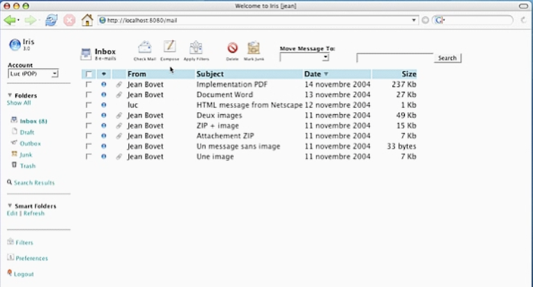
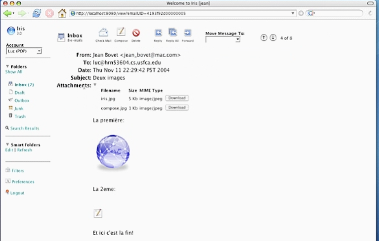
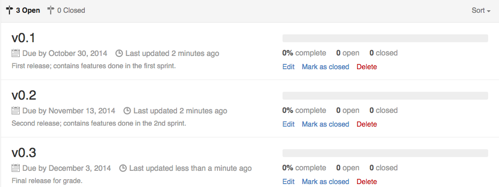
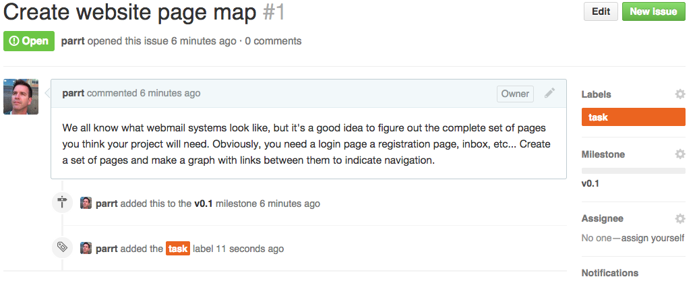
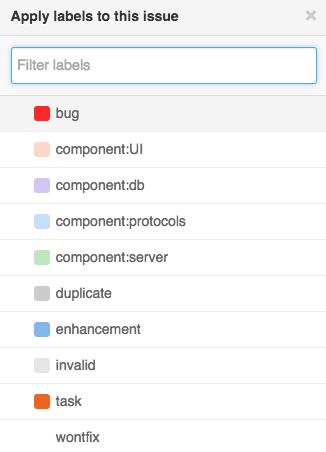
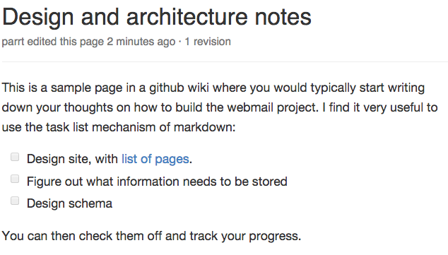

Webmail Project
====

*Final release due December 3, 2014.*

In this project you will build a website that acts as a web-based email client server like gmail or hotmail.   There will be three releases, v0.1-v0.3, with the last one due December 3rd, the last day of class.

To give you an idea what a successful project looks like, here are the videos Jean Bovet made of his project from years ago: [main presentation](movies/webmail/presentation.mov), [filter](movies/webmail/filter.mov), [move_delete](movies/webmail/html_move_delete.mov), [search](movies/webmail/search.mov), [smartfolders](movies/webmail/smartfolders.mov), [spellchecker](movies/webmail/spellchecker.mov).

 

You will make an appointment to demo and do a code review with the instructor at the last release. You will not receive a formal grade for the first two releases, but I will comment on your project to give you an idea of where I think you are and whether you are on track.

The overall project is scored as 100 points, but it is weighted more heavily than the other projects. *It is worth 30% of your overall grade.* Doing well on this project is critical to achieving a good grade in the class. *Some of the features are required to even pass the class.*

# Goals

The goal of this project is to produce something interesting and useful that requires you to combine the following knowledge:

* Java file I/O
* databases
* sockets
* Java Collections (data structures)
* multi-threaded programs
* protocols such as SMTP, POP
* web servers and web page generation
* client-side JavaScript / UI
* HTML
* search engine construction
* statistical pattern matching
* revision control systems (git)
* issue/release management
* UNIX (your server will run on linux)

Most people's projects end up being about 6-7000 lines of code.

# Features

The following is a list of features and the associated points you can acquire while constructing your webmail project. You are free to add additional features, but discuss it with the instructor first to determine its suitability and potential point value.

**You must complete all features marked with an x in the required column in order to pass the entire class.**

The breakdown is as follows:

* Required: 40 points
* Main functionality beyond required: 30 points
* Advanced feature: 5-10 points
* Quality: 15 points

|#|Required| Points | Feature |
|---|--------|--------|--------|
|1| x |4 | User registration. You must support multiple users, each with their own POP server to pull mail from and SMTP server to send email out of. Users are stored in the database. Passwords are not stored in the clear in the database.|
|2| x |2 | User log in/out |
|3| x | 1| Log each page request and also create log files, such as with `java.util.Logger`, for errors or other things you want to write to a log file. Store these logs in `/var/log/webmail` on your Linux server (see requirements below).|
|4| x |5 | Pull email from POP servers via your own POP protocol handler and display on website. Requires SSL connection to Gmail or similar.|
|5| x|2 | Mail pulled from POP is stored in the database. |
|6|x |3 | Obviously, you must have an `Inbox` folder/tag where incoming mail is displayed. |
|7|x|3 | View mail message page. |
|8|x|3 | Have a functional "check mail" button. |
|9|x|3| A compose message page. |
|10|x |4 | Send/reply to email using your own SMTP client. Use `smtp.usfca.edu` as the outgoing mail server.  You can also set it up to use SSL to connect to gmail's or any other if you want. |
|11| x|3 | Forward email feature.|
|12|x|5 | User is able to delete mail (sends to hardcoded or user-defined `Trash` folder/tag and then have a "empty trash button"). |
|13|x|2| Support HTTPS connections to your website not just HTTP.|
|14| |2 | An indication for messages and message lists (mailboxes) whether a message has been read or not. An ability to toggle read/unread.|
|15| |5| Mailbox view pagination so user can select page of multipage view. |
|16| |3 | Sent mail goes to hardcoded or user-defined `Sent` folder/tag. |
|17| |3 | Edit user account to change password etc... |
|18| |5 | Support user-defined "folders" or "tags" so users can direct incoming email to various folders manually. Users can move mail between folders by changing tags.|
|19| |3 | Support viewing of in-line email images. |
|20| |4 | User is able to search all of their mail for keywords; use a simple linear walk of the data via the database or FOR loop (rather than a sophisticed search engine like Lucene). The user should be able to pick the field such as "from" or "subject" to search in. |
|21| |5 | Sort mail folder display by various fields/columns such as sender's email, subject, ... |

Choose from *one* the following list of advanced features:

| # | Points | Feature |
|---|--------|--------|
|22|5 | Spell checking that highlights words not found in a large dictionary when the user clicks a button on the compose message page; or, more sophisticated functionality. |
|23|7 | Use of Lucene to search through email. The user should be able to pick the field such as "from" or "subject" to search in.|
|24|7 | A contact list feature that allows users to add, delete, and view contacts. It should also allow selection or auto completion or some other mechanism to make it easy to email those contacts.|
|25|10 | Support attachments (send/receive) |
|26|10 | SPAM filtering using something like a Naive Bayes classifier. You can use a library for this feature; i.e., don't build your own classifier.  User should be able to identify which messages are spam and which are not.|

In addition, your project will be evaluated on the following more subjective criteria:

| # | Points | Feature|
|---|--------|--------|
|27| 5 | Code quality as measured by instructor.|
|28| 5 | Overall aesthetic and design quality of the website.|
|29| 5 | Overall management of the project, including your prioritization of features and task completion. Includes how well you use git and github mechanisms such as releases, issues, and git commits etc...|

Notice that these subjective scores cover 15% of the project. Screwing these up means the most you can achieve is 85% on the entire project.

I have provided a [basic github repository](https://github.com/parrt/cs601-webmail-skeleton) that you can look at to learn more about using that website with releases and someone.

# Requirements

Among other things that I hope will be obvious or that we discussed in class, please make note of the following special requirements:

* You must do your project in Java and use the Jetty server as an embedded server. If you want to use a search engine, you must use Lucene.

* You are required to build functionality and design documents via github's wiki to complement your project.

* You must demonstrate your server running via a Linux server hosted at https://www.digitalocean.com. Naturally, you want to test it locally during development for quick turnaround time when you make a change, but ultimately it must work smoothly on a remote server. You can get a free account as a student. You must learn to deploy software on a Linux machine. In our case it's fairly easy because you can bundle jetty, your software, and any other libraries like Lucene as a single jar and ship it to the remote server. 

* You must run your server as `root` and have it listen at Port 80.

* Deploy your server software by putting your jar in the `/opt/webmail` directory.

* **Final submission of your project requires that you send instructor the public URL of your website.**

## External libraries

Bootstrap and UIKit and jquery are all okay for the webmail project.

Please stay away from angularjs, emberjs or any other full frameworks. Your JavaScript should only be for UI purposes and asynchronous pulling of data from the server.

If you do server-side page generation, I strongly suggest you use StringTemplate but you can use print statements if you want. I believe Velocity would also be another perfectly fine page template mechanism. Still be careful not to introduce libraries or use code in jetty, for example, that circumvent the goals of this project, such as to build your own SMTP and POP clients. 

Note that you will in fact have to use jetty for SSL connections to pop and SMTP servers, but you must still use your own software to implement protocols.

When in doubt, please ask me about a library or function. Always remember that the goal is to be as raw as possible, while still getting the project done in 7 weeks.

## Project management

You will make extensive use of github's features to manage and track your project.

### Tracking progress

Before you begin your project, go to github and add three [milestones](https://github.com/parrt/cs601-webmail-skeleton/milestones) such as I have done in the webmail skeleton:

Then you need to start adding formal [github issues](https://github.com/parrt/cs601-webmail-skeleton/issues) that coincide with features, tasks, and problems associated with your project. For example, here is an issue I created:

As you complete these, make sure you reference them with "`Fixes #n`" for issue n in your `git commit` messages and github will automatically close them for you and associate them with the current commit. It's important to keep issues and commits linked.

You can make a rich set of tags to help you organize your issues, as you can see I've done with mine:

My first issue is a `task` associated with milestone `v0.1`. As I complete issues associated with a milestone a progress bar will start to fill up when I look at my milestones at github.

### Releases

For each release, you will create a formal [github release](https://github.com/parrt/cs601-webmail-skeleton/releases), which involves creating a `git tag` and then creating a release on github itself associated with that tag. Tags are useful because you can reset your software to the state of a previous tag with a simple check out.

When you have created the release, then mark the milestone as closed. There might be a way to have github do this automatically (not sure).

### Documentation

An important part of any project's documentation about the design, architecture, and implementation of the software. These documents are much more important than user manuals; you do **not** have to make user manuals. Writing these design documents not only make it possible to bring other developers onto a project (or have them take over if you get hit by a bus), but it's a great way to organize your own thoughts. I have found that writing things down is invaluable because we can't keep everything in our head at once and later we will forget what we were thinking about.

You will also notice that there is a to do list on one of the wiki pages that I have:

There are lots and lots of little things to fix and implement as you build software. Unless you write them down, you will forget. The key is to write things down when you remember them.

# Grading

There is sufficient work in this project that only the best students will get near 100 points. An average graduate student will get in the mid-80s. This project provides enough room for the best programmers to strut their stuff.

*The authors of the best 2 projects, as determined by instructor one week beforehand, will be excused from exam II.*

**You must complete the required level to pass the entire class.**

*By definition, there is no late project*--your last working release will be considered in lieu of any unfinished project. At each release, I will look through your github repository and give you feedback on your progress.

You will make an appointment after the third release to sit with me into a code review and demo your project. Your project grade will be a function of instructor evaluation as determined by the point system above.
